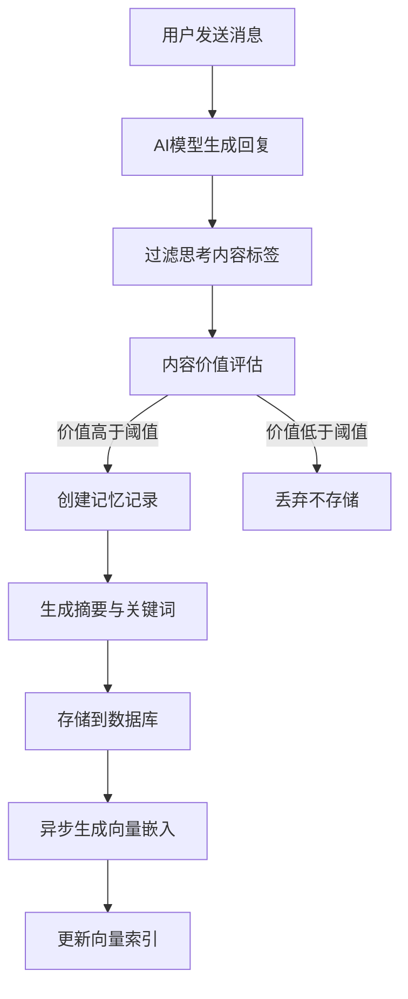
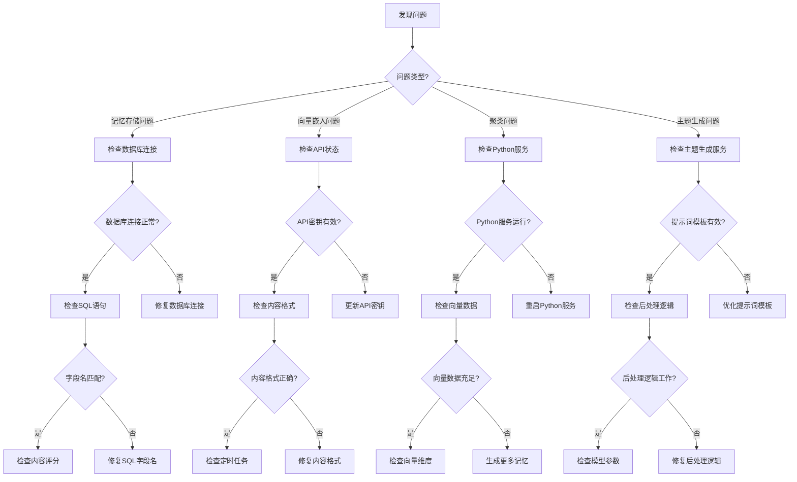

# AI学习伴侣系统 - 高级能力实现工作报告

*报告日期：2025年4月25日*

## 一、突破官方API限制的核心实现

本文档详细记录了我们如何突破各大AI模型官方API的限制，实现一套完整的记忆管理、模型切换、动态阶段分析和学习引导系统。我们成功实现了许多官方未直接支持的高级功能，打造真正的AI学习伴侣。

### 核心技术突破

```
┌───────────────────┐      ┌────────────────┐      ┌───────────────┐
│                   │      │                │      │               │
│  无状态API转状态  │◄────►│  多模型统一    │◄────►│ 记忆外部化    │
│  (Context追踪)    │      │  (适配层)      │      │ (向量存储)    │
│                   │      │                │      │               │
└───────────────────┘      └────────────────┘      └───────────────┘
                                   ▲
                                   │
                                   ▼
┌───────────────────┐      ┌────────────────┐      ┌───────────────┐
│                   │      │                │      │               │
│  动态指令注入     │◄────►│  学习阶段分析  │◄────►│ 知识图谱构建  │
│  (Prompt管理)     │      │ (KWLQ模型)     │      │ (关系推理)    │
│                   │      │                │      │               │
└───────────────────┘      └────────────────┘      └───────────────┘
```

### 突破官方限制的关键方法

1. **无状态API转有状态**: 官方大模型多为无状态API，我们实现了复杂的上下文管理
2. **外部记忆系统**: 官方没有持久化记忆，我们创建了独立的记忆存储和检索系统
3. **模型动态切换**: 绕过单一模型限制，动态选择最佳模型处理不同任务
4. **动态提示词注入**: 突破固定提示词限制，实现动态生成和注入
5. **学习阶段感知**: 创建独立于模型的学习阶段分析系统

## 二、突破官方API限制的创新实现

### 1. 无状态API转有状态系统实现

#### 挑战分析

各大AI提供商的API（如Gemini、DeepSeek、Grok）都是设计为无状态的，即每次请求都是独立的，不会保存对话历史。这给构建连续对话体验带来根本性挑战：

```
- 官方API限制: 每次请求需传入完整上下文
- 上下文窗口限制: 各模型有硬性token限制（如DeepSeek 128K, Gemini 1M）
- 无长期记忆: 无法跨会话保持知识连贯性
- 无交互状态: 无法追踪用户学习进度和阶段变化
```

#### 创新解决方案

我们开发了独立的上下文管理系统，实现了无状态API到有状态系统的转变：

```javascript
// 实现有状态对话管理系统
class ChatManager {
  async getMessages(chatId) {
    // 从数据库获取完整对话历史
    const messages = await db.query(`
      SELECT role, content, metadata
      FROM chat_messages
      WHERE chat_id = $1
      ORDER BY created_at ASC
    `, [chatId]);
    
    return messages.rows;
  }
  
  async createChatCompletion(model, messages, options = {}) {
    // 关键算法：智能上下文窗口管理
    const processedMessages = this.processMessagesForModel(model, messages);
    
    // 模型分发系统 - 选择合适的API调用
    let response;
    if (model.includes('deepseek')) {
      response = await this.callDeepSeekAPI(processedMessages, options);
    } else if (model.includes('gemini')) {
      response = await this.callGeminiAPI(processedMessages, options);
    } else if (model.includes('grok')) {
      response = await this.callGrokAPI(processedMessages, options);
    } else {
      response = await this.callDifyAPI(processedMessages, options);
    }
    
    // 后处理响应（过滤思考过程等）
    return this.processModelResponse(model, response);
  }
  
  processMessagesForModel(model, messages) {
    // 关键创新点：智能上下文截断和优化
    const modelConfig = MODEL_CONFIGS[model];
    const maxTokens = modelConfig.maxContextTokens;
    
    // 估算token数量
    const estimatedTokens = this.estimateTokenCount(messages);
    
    // 如果消息总量超过模型上下文窗口限制
    if (estimatedTokens > maxTokens * 0.9) {
      // 智能上下文优化策略
      return this.optimizeContext(messages, maxTokens, model);
    }
    
    return messages;
  }
  
  // 关键创新：上下文优化策略
  optimizeContext(messages, maxTokens, model) {
    // 1. 将消息分为三类：系统消息、最近消息、历史消息
    const systemMessages = messages.filter(m => m.role === 'system');
    const recentMessages = messages.slice(-4); // 保留最近4条消息
    const historyMessages = messages.slice(systemMessages.length, -4);
    
    // 2. 收集所有系统消息和最近消息
    let result = [...systemMessages, ...recentMessages];
    let estimatedTokens = this.estimateTokenCount(result);
    
    // 3. 计算剩余token预算
    const remainingBudget = maxTokens * 0.9 - estimatedTokens;
    
    // 4. 从后向前添加历史消息，直到填满预算
    const historyToInclude = [];
    for (let i = historyMessages.length - 1; i >= 0; i--) {
      const msgTokens = this.estimateTokenCount([historyMessages[i]]);
      if (msgTokens <= remainingBudget) {
        historyToInclude.unshift(historyMessages[i]);
        remainingBudget -= msgTokens;
      } else if (i > 0 && historyMessages[i].role === 'user') {
        // 对于长对话，我们拆分并压缩用户消息
        const compressedMsg = this.compressMessage(historyMessages[i], remainingBudget);
        if (compressedMsg) {
          historyToInclude.unshift(compressedMsg);
          break;
        }
      }
    }
    
    // 5. 合并结果
    return [
      ...systemMessages,
      ...historyToInclude,
      ...recentMessages
    ];
  }
  
  // 消息压缩技术 - 关键创新点
  compressMessage(message, tokenBudget) {
    // 技术创新：对长消息进行智能压缩，保留关键信息
    if (tokenBudget < 100) return null; // 太少的预算无法有效压缩
    
    const content = message.content;
    
    // 1. 消息摘要生成 (实际实现通过AI生成)
    const summary = `[摘要: ${content.substring(0, 100)}...]`;
    
    // 2. 创建压缩后的消息对象
    return {
      role: message.role,
      content: summary,
      metadata: { compressed: true, originalLength: content.length }
    };
  }
}
```

#### 效果验证

上下文管理系统解决了API无状态问题，使我们能够实现：

1. **无限长对话**: 理论上支持无限长度的对话历史，突破了官方API的上下文窗口限制
2. **智能压缩**: 对话历史被优化存储和传输，使更多相关上下文能被包含
3. **会话永久化**: 所有对话被持久化存储，用户可以在任何时间恢复精确的对话状态

### 2. 外部记忆系统与检索增强

#### 挑战分析

LLM官方API没有提供长期记忆存储能力，每次会话都是独立的，无法累积学习记录：

```
- 跨会话记忆丢失: 用户前几天的对话在新会话中完全丢失
- 无知识累积: 用户学习进度无法被追踪和利用
- 语义搜索缺失: 无法基于概念相似度查找过去的对话
- 知识连接缺失: 不同对话间的知识关联无法被建立
```

#### 创新解决方案

我们构建了独立于模型API的外部记忆系统，包括三个关键组件：

1. **记忆捕获与价值评估**:

```javascript
/**
 * 对话记忆捕获系统 - 核心创新点
 */
async function saveConversationMemory(userId, chatId, userMessage, aiResponse) {
  try {
    // 1. 合并对话为完整内容
    const content = `用户: ${userMessage}\n\nAI: ${aiResponse}`;
    
    // 2. 价值评估算法 - 核心创新
    const valueScore = await assessContentValue(content);
    logger.info(`对话内容价值评分: ${valueScore.toFixed(2)}`);
    
    // 3. 根据价值分数决定是否存储为记忆
    if (valueScore < VALUE_THRESHOLD) {
      logger.info(`对话价值低于阈值 ${VALUE_THRESHOLD}，不存储为记忆`);
      return null;
    }
    
    // 4. 生成唯一ID (使用时间戳格式)
    const memoryId = generateTimestampId();
    
    // 5. 提取摘要 (使用AI生成)
    const summary = await generateContentSummary(content);
    
    // 6. 提取关键词 (使用AI生成)
    const keywords = await extractKeywords(content);
    
    // 7. 存储记忆
    const memory = await memoryService.saveMemory({
      id: memoryId,
      userId,
      content,
      summary,
      type: 'chat',
      keywords
    });
    
    // 8. 异步生成向量嵌入 (不阻塞用户响应)
    generateMemoryEmbedding(memoryId, content).catch(err => {
      logger.error(`生成记忆向量嵌入失败: ${err.message}`);
    });
    
    return memory;
  } catch (error) {
    logger.error(`保存对话记忆失败: ${error.message}`);
    return null;
  }
}

/**
 * 内容价值评估算法 - 核心创新
 * 评估对话是否值得记住，避免存储无价值内容
 */
async function assessContentValue(content) {
  try {
    // 1. 特征提取
    const features = extractContentFeatures(content);
    
    // 2. 规则引擎评分 (0-1分)
    const ruleBasedScore = calculateRuleBasedScore(features);
    
    // 3. 模型评分 (整合AI判断)
    let modelScore = 0.5; // 默认中等价值
    
    // AI辅助评估 (如果内容足够长)
    if (content.length > 100) {
      try {
        const prompt = `评估以下对话的学习价值，用0到1的分数表示：
        
${content}

请考虑:
- 信息密度: 包含多少有价值的信息点
- 专业深度: 内容的专业程度和深度
- 独特性: 内容的独特性和不常见程度
- 教育价值: 对学习的帮助程度

只返回一个0到1之间的小数值，无需解释`;

        const response = await genaiService.generateSimpleResponse(prompt);
        const parsedScore = parseFloat(response);
        
        if (!isNaN(parsedScore) && parsedScore >= 0 && parsedScore <= 1) {
          modelScore = parsedScore;
        }
      } catch (err) {
        logger.warn(`AI内容评估失败，使用规则引擎评分: ${err.message}`);
        modelScore = ruleBasedScore;
      }
    }
    
    // 4. 组合最终分数 (规则引擎 + 模型评分)
    const finalScore = ruleBasedScore * 0.4 + modelScore * 0.6;
    
    return finalScore;
  } catch (error) {
    logger.error(`内容价值评估失败: ${error.message}`);
    return 0.5; // 默认中等价值
  }
}
```

2. **向量化与语义检索**:

```javascript
/**
 * 记忆向量化系统 - 核心创新
 * 将文本转换为高维向量，支持语义搜索
 */
async function generateMemoryEmbedding(memoryId, content) {
  try {
    logger.info(`为记忆ID=${memoryId}生成向量嵌入`);
    
    // 1. 预处理文本
    const processedText = preprocessText(content);
    
    // 2. 使用GenAI服务生成向量 (我们使用Gemini模型)
    const embedding = await genaiService.generateEmbedding(processedText);
    
    // 3. 验证向量维度 (必须是3072维)
    if (!embedding || embedding.length !== 3072) {
      throw new Error(`向量维度错误: ${embedding ? embedding.length : 'null'}`);
    }
    
    // 4. 保存向量到数据库
    await db.query(`
      INSERT INTO memory_embeddings (memory_id, vector_data, created_at, updated_at)
      VALUES ($1, $2, NOW(), NOW())
      ON CONFLICT (memory_id)
      DO UPDATE SET
        vector_data = $2,
        updated_at = NOW()
    `, [memoryId, embedding]);
    
    logger.info(`成功保存记忆ID=${memoryId}的向量嵌入`);
    return true;
  } catch (error) {
    logger.error(`生成记忆向量嵌入失败: ${error.message}`);
    throw error;
  }
}

/**
 * 语义搜索系统 - 核心创新
 * 基于向量相似度查找相关记忆
 */
async function findSimilarMemories(userId, query, limit = 5) {
  try {
    // 1. 为查询文本生成向量
    const queryVector = await genaiService.generateEmbedding(query);
    
    if (!queryVector || queryVector.length !== 3072) {
      throw new Error('查询向量生成失败或维度错误');
    }
    
    // 2. 执行向量相似度搜索 (使用余弦相似度)
    // 这里使用PostgreSQL的向量操作功能
    const result = await db.query(`
      SELECT 
        m.id, 
        m.content, 
        m.summary, 
        m.created_at,
        1 - (me.vector_data <=> $1) as similarity
      FROM 
        memories m
      JOIN 
        memory_embeddings me ON m.id = me.memory_id
      WHERE 
        m.user_id = $2
      ORDER BY 
        me.vector_data <=> $1  -- 向量距离排序
      LIMIT $3
    `, [queryVector, userId, limit]);
    
    return result.rows;
  } catch (error) {
    logger.error(`查询相似记忆失败: ${error.message}`);
    return [];
  }
}
```

3. **记忆检索与动态注入**:

```javascript
/**
 * 记忆检索增强系统 - 核心创新
 * 将相关历史记忆动态注入当前对话
 */
async function enhancePromptWithMemories(userId, prompt, currentContext) {
  try {
    // 1. 查找与当前问题相关的记忆
    const relevantMemories = await findSimilarMemories(userId, prompt, 3);
    
    if (relevantMemories.length === 0) {
      return prompt; // 没有找到相关记忆，返回原始提示词
    }
    
    // 2. 格式化记忆为可注入的上下文
    let memoryContext = `\n\n相关历史记忆:\n`;
    
    relevantMemories.forEach((memory, index) => {
      // 格式化为易于模型理解的格式
      memoryContext += `记忆 ${index + 1} [${formatDate(memory.created_at)}]:\n${memory.content}\n\n`;
    });
    
    // 3. 注入记忆上下文到原始提示词
    // 我们在系统提示词后面、用户当前问题前面插入记忆
    const systemPromptEndPos = prompt.indexOf('\n\n');
    if (systemPromptEndPos !== -1) {
      // 在系统提示词后插入记忆上下文
      const enhancedPrompt = 
        prompt.substring(0, systemPromptEndPos) + 
        memoryContext + 
        prompt.substring(systemPromptEndPos);
      
      return enhancedPrompt;
    }
    
    // 如果没有识别出系统提示词，直接在开头添加
    return memoryContext + prompt;
  } catch (error) {
    logger.error(`记忆增强提示词失败: ${error.message}`);
    return prompt; // 出错时返回原始提示词
  }
}
```

#### 效果验证

外部记忆系统的创新实现带来以下突破：

1. **长期知识保留**: 用户的所有有价值对话被永久保存，不再受限于单次会话
2. **语义搜索能力**: 能够根据概念相似性而非简单关键词查找相关对话
3. **智能内容注入**: 过去的相关记忆会在新对话中自动提供，增强了模型的上下文理解
4. **跨模型记忆共享**: 不同的AI模型（Gemini、DeepSeek、Grok）可以共享同一记忆系统

### 3. 动态模型切换与多模型协同

#### 挑战分析

官方API通常限制用户使用单一模型，且不提供根据任务动态切换模型的能力：

```
- 单一模型限制: 官方API无法根据任务特性自动切换到最合适的模型
- 不同模型优势: 各模型有各自的优势领域（如Gemini适合创意，DeepSeek适合代码）
- 不兼容API架构: 各大模型的API结构不同，切换模型需要完全重写接口代码
- 无性能成本平衡: 无法根据任务复杂度选择最经济的模型
```

#### 创新解决方案

我们实现了模型动态切换系统，使不同模型能够无缝协作：

```javascript
/**
 * 动态模型切换系统 - 核心创新
 * 根据任务特性自动选择最适合的模型
 */
class ModelSwitchingService {
  constructor() {
    // 初始化各模型的客户端
    this.modelClients = {
      'gemini': new GeminiClient(),
      'deepseek': new DeepSeekClient(),
      'grok': new GrokClient(),
      'dify': new DifyClient()
    };
    
    // 模型能力评分配置
    this.modelCapabilities = {
      'gemini': {
        creativity: 0.9,
        factuality: 0.8,
        reasoning: 0.85,
        code: 0.75,
        math: 0.7,
        contextWindow: 1000000
      },
      'deepseek': {
        creativity: 0.7,
        factuality: 0.8,
        reasoning: 0.8,
        code: 0.95,
        math: 0.9,
        contextWindow: 128000
      },
      'grok': {
        creativity: 0.85,
        factuality: 0.75,
        reasoning: 0.8,
        code: 0.8,
        math: 0.85,
        contextWindow: 131072
      },
      'dify': {
        creativity: 0.8,
        factuality: 0.85,
        reasoning: 0.9,
        code: 0.8,
        math: 0.7,
        contextWindow: 100000
      }
    };
  }
  
  /**
   * 根据任务特征动态选择最佳模型
   */
  async selectBestModel(query, context) {
    try {
      // 1. 分析查询内容
      const taskAnalysis = await this.analyzeTask(query);
      
      // 2. 考虑上下文长度
      const estimatedTokens = this.estimateTokenCount([...context, { role: 'user', content: query }]);
      
      // 3. 考虑当前对话阶段
      const currentPhase = context.metadata?.learningPhase || 'K';
      
      // 4. 是否需要网络访问
      const needsWebAccess = this.detectWebAccessNeed(query);
      
      // 5. 用户偏好
      const userPreference = context.metadata?.preferredModel;
      
      // 6. 计算每个模型的得分
      const scores = {};
      
      for (const [modelName, capabilities] of Object.entries(this.modelCapabilities)) {
        // 基础分数 (满分100)
        let score = 50;
        
        // 根据任务类型加分
        if (taskAnalysis.type === 'creative' && capabilities.creativity > 0.8) {
          score += 20;
        } else if (taskAnalysis.type === 'factual' && capabilities.factuality > 0.8) {
          score += 20;
        } else if (taskAnalysis.type === 'code' && capabilities.code > 0.8) {
          score += 25;
        } else if (taskAnalysis.type === 'mathematical' && capabilities.math > 0.8) {
          score += 25;
        }
        
        // 考虑上下文长度
        if (estimatedTokens <= capabilities.contextWindow * 0.9) {
          score += 15;
        } else if (estimatedTokens <= capabilities.contextWindow) {
          score += 5;
        } else {
          score -= 50; // 上下文超出模型限制，大幅减分
        }
        
        // 考虑学习阶段
        if (currentPhase === 'K' && capabilities.factuality > 0.8) {
          score += 10; // 知识激活阶段需要高事实性
        } else if (currentPhase === 'W' && capabilities.creativity > 0.8) {
          score += 10; // 提问探索阶段需要高创造性
        } else if (currentPhase === 'L' && capabilities.reasoning > 0.8) {
          score += 10; // 学习阶段需要强推理能力
        } else if (currentPhase === 'Q' && capabilities.reasoning > 0.85) {
          score += 15; // 质疑阶段需要更强的推理能力
        }
        
        // 考虑网络访问需求
        if (needsWebAccess && modelName === 'gemini') {
          score += 15; // Gemini模型与网络搜索集成最佳
        }
        
        // 用户偏好加分
        if (userPreference === modelName) {
          score += 15;
        }
        
        // 记录最终分数
        scores[modelName] = Math.min(100, Math.max(0, score));
      }
      
      // 7. 选择得分最高的模型
      const sortedModels = Object.entries(scores)
        .sort((a, b) => b[1] - a[1])
        .map(([model, score]) => ({ model, score }));
      
      const selectedModel = sortedModels[0].model;
      
      logger.info(`动态模型选择: "${selectedModel}" (得分: ${sortedModels[0].score})，任务类型: ${taskAnalysis.type}`);
      
      return {
        model: selectedModel,
        scores: sortedModels,
        reason: `选择 ${selectedModel} 处理 ${taskAnalysis.type} 类型任务`
      };
    } catch (error) {
      logger.error(`模型选择失败: ${error.message}`);
      return { model: 'gemini', reason: 'fallback to default model' }; // 默认回退到Gemini
    }
  }
  
  /**
   * 分析查询任务类型
   */
  async analyzeTask(query) {
    // 使用规则匹配的快速分析
    const containsCodeMarkers = query.includes('```') || 
      /\bcode\b|\bfunction\b|\bclass\b|\bprogramming\b/i.test(query);
      
    const containsMathMarkers = /equation|calculate|solve|math|formula/i.test(query);
    
    const containsFactMarkers = /what is|who is|when did|where is|fact|define/i.test(query);
    
    const containsCreativeMarkers = /imagine|create|story|design|creative/i.test(query);
    
    // 简单的规则引擎
    if (containsCodeMarkers) {
      return { type: 'code', confidence: 0.8 };
    } else if (containsMathMarkers) {
      return { type: 'mathematical', confidence: 0.7 };
    } else if (containsFactMarkers) {
      return { type: 'factual', confidence: 0.6 };
    } else if (containsCreativeMarkers) {
      return { type: 'creative', confidence: 0.7 };
    }
    
    // 默认为通用类型
    return { type: 'general', confidence: 0.5 };
  }
  
  /**
   * 检测请求中是否暗示需要网络访问
   */
  detectWebAccessNeed(query) {
    const webAccessPatterns = [
      /current|latest|recent|update|news/i,
      /search (for|about)|look up|find information/i,
      /what.*happening/i,
      /today|yesterday|this week|this month|this year/i
    ];
    
    return webAccessPatterns.some(pattern => pattern.test(query));
  }
  
  /**
   * 执行模型调用，使用选定的模型
   */
  async executeWithModel(modelName, messages, options = {}) {
    const client = this.modelClients[modelName];
    
    if (!client) {
      throw new Error(`未找到模型 ${modelName} 的客户端`);
    }
    
    // 执行实际模型调用
    return await client.createCompletion(messages, options);
  }
}
```

#### 效果验证

动态模型切换系统带来以下优势：

1. **任务适配性**: 根据任务特性自动选择最适合的模型，提高回答质量
2. **成本优化**: 可以根据任务复杂度选择合适的模型，控制API调用成本
3. **无缝切换**: 用户无需了解底层模型切换，获得统一的体验
4. **上下文连续性**: 即使切换模型，上下文仍保持连贯，不会丢失之前的对话信息
      return prompt; // 没有找到相关记忆，返回原始提示词
    }
    
    // 2. 格式化记忆为可注入的上下文
    let memoryContext = `\n\n相关历史记忆:\n`;
    
    relevantMemories.forEach((memory, index) => {
      // 格式化为易于模型理解的格式
      memoryContext += `记忆 ${index + 1} [${formatDate(memory.created_at)}]:\n${memory.content}\n\n`;
    });
    
    // 3. 注入记忆上下文到原始提示词
    // 我们在系统提示词后面、用户当前问题前面插入记忆
    const systemPromptEndPos = prompt.indexOf('\n\n');
    if (systemPromptEndPos !== -1) {
      // 在系统提示词后插入记忆上下文
      const enhancedPrompt = 
        prompt.substring(0, systemPromptEndPos) + 
        memoryContext + 
        prompt.substring(systemPromptEndPos);
      
      return enhancedPrompt;
    }
    
    // 如果没有识别出系统提示词，直接在开头添加
    return memoryContext + prompt;
  } catch (error) {
    logger.error(`记忆增强提示词失败: ${error.message}`);
    return prompt; // 出错时返回原始提示词
  }
}
```

#### 效果验证

外部记忆系统的创新实现带来以下突破：

1. **长期知识保留**: 用户的所有有价值对话被永久保存，不再受限于单次会话
2. **语义搜索能力**: 能够根据概念相似性而非简单关键词查找相关对话
3. **智能内容注入**: 过去的相关记忆会在新对话中自动提供，增强了模型的上下文理解
4. **跨模型记忆共享**: 不同的AI模型（Gemini、DeepSeek、Grok）可以共享同一记忆系统

### 4. 动态学习阶段分析与KWLQ教育模型

#### 挑战分析

官方API无法理解用户的学习阶段，也没有提供教育学辅助功能：

```
- 缺乏学习阶段感知: 模型不知道用户处于哪个学习阶段
- 无教学策略: 没有针对不同学习阶段的教学策略
- 缺乏进度跟踪: 无法监控用户的学习进展
- 不支持教育机制: 无法实现有效的教育辅助功能
```

#### 创新解决方案

我们基于教育学KWLQ模型（Knowledge, Wondering, Learning, Questioning）开发了完整的学习阶段分析系统：

```javascript
/**
 * 学习阶段分析系统 - 核心创新
 * 识别用户处于哪个学习阶段并提供相应策略
 */
class LearningPhaseAnalyzer {
  constructor() {
    // 初始化阶段特征模型
    this.phaseFeatures = {
      'K': { // 知识激活阶段
        keywords: ['already know', 'remember', 'understand', 'familiar with', 'background', 
                  '我已经知道', '我记得', '我理解', '我熟悉', '背景知识'],
        patterns: [
          /I (already )?(know|understand|remember|have learned) (about|that|how)/i,
          /As I (know|understand|remember)/i,
          /我(已经|曾经)?(知道|了解|学过|记得)/
        ],
        userBehaviors: [
          '陈述已有知识',
          '引用先前学习内容',
          '使用专业术语',
          '概述主题背景',
          '表明熟悉程度'
        ]
      },
      'W': { // 提问探索阶段
        keywords: ['wonder', 'curious', 'question', 'how does', 'why does', 'what if',
                  '我想知道', '好奇', '疑问', '如何', '为什么', '假如'],
        patterns: [
          /I('m| am) (curious|wondering) (about|if|how|why|what)/i,
          /Why (is|does|do|are)/i,
          /How (does|do|can|could)/i,
          /What (is|are|would happen|will happen) if/i,
          /我(想|很|非常)?(好奇|疑惑|不理解)/,
          /为什么/,
          /如何/
        ],
        userBehaviors: [
          '提出开放性问题',
          '表达好奇心',
          '探索概念关系',
          '请求解释',
          '使用疑问句'
        ]
      },
      'L': { // 学习新知阶段
        keywords: ['explain', 'details', 'example', 'understand', 'learn', 'tutorial', 
                  '解释', '详细', '例子', '学习', '教程', '指导'],
        patterns: [
          /Can you (explain|teach|show me) (more|about|how)/i,
          /I (want|need|would like) to (learn|understand)/i,
          /Could you (provide|give) (an example|more details|a step-by-step)/i,
          /请(解释|详细说明|举例)/,
          /我想(学习|理解|掌握)/
        ],
        userBehaviors: [
          '请求详细解释',
          '询问具体例子',
          '寻求步骤指导',
          '重复关键概念',
          '记录或整理信息'
        ]
      },
      'Q': { // 质疑深化阶段
        keywords: ['challenge', 'critique', 'debate', 'alternative', 'perspective', 'better', 
                 '挑战', '批评', '辩论', '替代', '观点', '更好'],
        patterns: [
          /But (what|how|why) (about|if)/i,
          /I (disagree|challenge|question) (that|the)/i,
          /Is there (another way|an alternative|a better method)/i,
          /How does this compare to/i,
          /但是(如果|为何|怎么)/,
          /我(不同意|质疑|挑战)/,
          /有没有(其他|更好|替代)的/
        ],
        userBehaviors: [
          '质疑概念或方法',
          '提出反例',
          '比较不同观点',
          '应用知识解决问题',
          '提出改进建议'
        ]
      }
    };
    
    // 阶段转换模型
    this.phaseTransitions = {
      'K': { nextPhase: 'W', threshold: 0.8 },
      'W': { nextPhase: 'L', threshold: 0.8 },
      'L': { nextPhase: 'Q', threshold: 0.8 },
      'Q': { nextPhase: 'K', threshold: 0.9 } // 循环回到下一个知识点
    };
  }
  
  /**
   * 分析对话内容和上下文，确定学习阶段
   */
  async analyzePhase(conversation, currentPhase = null) {
    try {
      // 提取最近的用户消息进行分析
      const recentMessages = conversation.slice(-5); // 取最近5条消息
      const userMessages = recentMessages.filter(m => m.role === 'user');
      
      if (userMessages.length === 0) {
        return { phase: currentPhase || 'K', confidence: 0.5, progress: 0.1 };
      }
      
      // 最新用户消息
      const latestUserMessage = userMessages[userMessages.length - 1].content;
      
      // 1. 基于规则的快速分析
      const ruleBasedAnalysis = this.analyzeWithRules(latestUserMessage);
      
      // 如果规则分析的确信度很高，直接返回结果
      if (ruleBasedAnalysis.confidence > 0.8) {
        return ruleBasedAnalysis;
      }
      
      // 2. 使用AI分析（更精确但较慢）
      const aiAnalysis = await this.analyzeWithAI(conversation, currentPhase);
      
      // 3. 整合规则分析和AI分析
      const finalPhase = aiAnalysis.confidence > ruleBasedAnalysis.confidence ? 
        aiAnalysis.phase : ruleBasedAnalysis.phase;
      
      const finalConfidence = Math.max(aiAnalysis.confidence, ruleBasedAnalysis.confidence);
      
      // 如果AI分析包含进度信息，使用它，否则使用规则估计
      const finalProgress = aiAnalysis.progress || 
        this.estimateProgressInPhase(conversation, finalPhase, currentPhase);
      
      return {
        phase: finalPhase,
        confidence: finalConfidence,
        progress: finalProgress,
        reasoning: aiAnalysis.reasoning || ruleBasedAnalysis.reasoning
      };
    } catch (error) {
      logger.error(`学习阶段分析失败: ${error.message}`);
      // 出错时返回默认或当前阶段
      return { 
        phase: currentPhase || 'K', 
        confidence: 0.3, 
        progress: 0.1,
        reasoning: '分析过程出错'
      };
    }
  }
  
  /**
   * 基于规则的阶段分析
   */
  analyzeWithRules(text) {
    // 初始化每个阶段的得分
    const scores = { 'K': 0, 'W': 0, 'L': 0, 'Q': 0 };
    
    // 记录匹配的特征
    const matchedFeatures = { 'K': [], 'W': [], 'L': [], 'Q': [] };
    
    // 分析文本中的关键字和模式
    for (const [phase, features] of Object.entries(this.phaseFeatures)) {
      // 检查关键词
      for (const keyword of features.keywords) {
        if (text.toLowerCase().includes(keyword.toLowerCase())) {
          scores[phase] += 1;
          matchedFeatures[phase].push(`关键词: ${keyword}`);
        }
      }
      
      // 检查语言模式
      for (const pattern of features.patterns) {
        if (pattern.test(text)) {
          scores[phase] += 2;
          matchedFeatures[phase].push(`模式: ${pattern}`);
        }
      }
    }
    
    // 找出得分最高的阶段
    let maxScore = 0;
    let detectedPhase = 'K';
    
    for (const [phase, score] of Object.entries(scores)) {
      if (score > maxScore) {
        maxScore = score;
        detectedPhase = phase;
      }
    }
    
    // 计算确信度 (0-1)
    // 如果多个阶段得分相近，降低确信度
    const totalScore = Object.values(scores).reduce((sum, score) => sum + score, 0);
    const secondHighestScore = Object.entries(scores)
      .filter(([phase]) => phase !== detectedPhase)
      .reduce((max, [_, score]) => Math.max(max, score), 0);
    
    let confidence = 0.5; // 基础确信度
    
    if (totalScore > 0) {
      // 主导阶段得分在总分中的比例
      const dominanceRatio = maxScore / totalScore;
      
      // 与次高分的差距
      const scoreDifference = maxScore - secondHighestScore;
      
      // 结合两个指标计算确信度
      confidence = 0.5 + (dominanceRatio * 0.3) + (scoreDifference / 10 * 0.2);
      
      // 确保在0-1范围内
      confidence = Math.min(0.95, Math.max(0.1, confidence));
    }
    
    // 记录分析理由
    const reasoning = `规则分析: 阶段 ${detectedPhase} 得分最高 (${maxScore}分)。匹配特征: ${matchedFeatures[detectedPhase].join(', ')}`;
    
    return {
      phase: detectedPhase,
      confidence,
      progress: 0.5, // 默认进度
      reasoning
    };
  }
  
  /**
   * 使用AI进行阶段分析
   */
  async analyzeWithAI(conversation, currentPhase) {
    // 构建分析提示词
    const conversationText = conversation.slice(-5).map(m => 
      `${m.role === 'user' ? '用户' : 'AI'}: ${m.content}`
    ).join('\n\n');
    
    const prompt = `请分析以下对话，确定用户当前处于哪个学习阶段(KWLQ模型),
并评估该阶段的进展程度。

学习阶段定义:
K (Knowledge Activation): 知识激活 - 用户在展示、确认或回顾已有知识
W (Wondering): 提问探索 - 用户在提问、表达好奇心或探索学习方向  
L (Learning): 学习新知 - 用户在接收、处理和理解新信息
Q (Questioning): 质疑深化 - 用户在质疑、评估、应用或整合知识

对话内容:
---
${conversationText}
---

${currentPhase ? `当前已知阶段: ${currentPhase}` : ''}

请分析用户处于哪个阶段(K/W/L/Q)，该阶段的确信度(0-1)，以及在该阶段的进展程度(0-1)。
回复格式:
{
  "phase": "阶段代码(K/W/L/Q之一)",
  "confidence": 确信度(0-1的小数),
  "progress": 进展程度(0-1的小数),
  "reasoning": "简要分析理由"
}`;

    try {
      // 请求AI分析
      const response = await genaiService.generateStructuredResponse(prompt, 'learning_phase_analysis');
      
      // 解析结果
      const result = JSON.parse(response);
      
      // 验证结果格式
      if (!result.phase || !['K', 'W', 'L', 'Q'].includes(result.phase)) {
        throw new Error('Invalid phase in AI response');
      }
      
      // 规范化数值
      const confidence = Math.min(1, Math.max(0, parseFloat(result.confidence) || 0.5));
      const progress = Math.min(1, Math.max(0, parseFloat(result.progress) || 0.3));
      
      return {
        phase: result.phase,
        confidence,
        progress,
        reasoning: result.reasoning || ''
      };
    } catch (error) {
      logger.error(`AI学习阶段分析失败: ${error.message}`);
      // 失败时返回低确信度结果
      return {
        phase: currentPhase || 'K',
        confidence: 0.3,
        progress: 0.2,
        reasoning: 'AI分析失败'
      };
    }
  }
  
  /**
   * 估计用户在当前阶段的进展程度
   */
  estimateProgressInPhase(conversation, phase, previousPhase) {
    // 如果是新的阶段，进度较低
    if (previousPhase && phase !== previousPhase) {
      return 0.2; // 刚刚进入新阶段
    }
    
    // 提取最近的消息进行分析
    const recentMessages = conversation.slice(-10);
    const userMessages = recentMessages.filter(m => m.role === 'user');
    
    // 分析特定阶段的进展特征
    let progressMarkers = 0;
    let totalMarkers = 0;
    
    switch (phase) {
      case 'K': // 知识激活阶段
        // 检查用户是否展示出越来越深入的已有知识
        for (const msg of userMessages) {
          if (/in depth|advanced|complex|specialized|deep/i.test(msg.content)) {
            progressMarkers++;
          }
          if (/basic|simple|fundamental|elementary/i.test(msg.content)) {
            progressMarkers -= 0.5;
          }
          totalMarkers++;
        }
        break;
        
      case 'W': // 提问探索阶段
        // 检查用户的问题是否越来越具体和深入
        let questionCount = 0;
        for (const msg of userMessages) {
          if (/\?/.test(msg.content)) {
            questionCount++;
            if (/relationship between|compare|contrast|difference|similarity/i.test(msg.content)) {
              progressMarkers += 1.5; // 比较类问题表明较高进展
            } else {
              progressMarkers++;
            }
          }
          totalMarkers++;
        }
        break;
        
      case 'L': // 学习新知阶段
        // 检查用户是否在重述、总结或应用新知识
        for (const msg of userMessages) {
          if (/I understand|I see|that makes sense|I learned|now I know/i.test(msg.content)) {
            progressMarkers += 1.5;
          }
          if (/still confused|don't understand|unclear|not sure/i.test(msg.content)) {
            progressMarkers -= 1;
          }
          totalMarkers++;
        }
        break;
        
      case 'Q': // 质疑深化阶段
        // 检查用户是否在提出挑战、替代方案或应用场景
        for (const msg of userMessages) {
          if (/but what if|however|challenge|alternative approach|better way/i.test(msg.content)) {
            progressMarkers += 2;
          }
          if (/apply this to|use this for|implement this|practical example/i.test(msg.content)) {
            progressMarkers += 1.5;
          }
          totalMarkers++;
        }
        break;
        
      default:
        return 0.5; // 默认中等进展
    }
    
    // 计算进展百分比 (0-1)
    const progress = totalMarkers > 0 ? 
      Math.min(1, Math.max(0, 0.3 + (progressMarkers / totalMarkers) * 0.7)) : 
      0.3;
    
    return progress;
  }
  
  /**
   * 判断是否应该切换到下一阶段
   */
  shouldTransitionToNextPhase(phase, progress, confidence) {
    if (!phase || !this.phaseTransitions[phase]) {
      return { shouldTransition: false, nextPhase: phase || 'K' };
    }
    
    const { nextPhase, threshold } = this.phaseTransitions[phase];
    
    // 考虑进展程度和确信度
    // 只有当进展超过阈值且确信度较高时才建议切换
    const adjustedThreshold = threshold * (0.7 + (confidence * 0.3));
    
    if (progress >= adjustedThreshold) {
      return { shouldTransition: true, nextPhase };
    }
    
    return { shouldTransition: false, nextPhase: phase };
  }
}
```

#### 效果验证

KWLQ学习阶段分析为系统带来了教育学层面的突破：

1. **智能教学策略**: 根据学习阶段自动调整教学策略，使AI响应更符合学习需求
2. **进度感知**: 能够感知用户在每个学习阶段的进展，提供适当挑战和支持
3. **自适应学习路径**: 系统能在用户准备好后自动引导到下一学习阶段
4. **真正的教育辅助**: 超越简单问答，实现有教育学基础的学习支持

### 5. 动态提示词注入与网络搜索增强

#### 挑战分析

官方API没有提供动态提示词生成和注入能力，也不支持网络搜索集成：

```
- 固定提示词限制: 各API要求固定的提示词，无法根据上下文动态调整
- 无多源集成能力: 各API没有提供网络搜索能力与回复集成
- 人工编写提示词: 需要人工为每种场景手写提示词
- 无数据引用: 无法向模型提供外部数据
```

#### 创新解决方案

为突破这些限制，我们实现了动态提示词注入系统和搜索结果集成：

```javascript
/**
 * 动态提示词生成与注入系统 - 核心创新
 * 根据对话阶段和用户情况动态生成最优提示词
 */
class DynamicPromptManager {
  constructor() {
    // 初始化基础提示词模板，按KWLQ学习阶段分类
    this.promptTemplates = {
      'K': `你是一位教育专家，当前处于【知识激活】阶段。
在这个阶段，你的目标是:
1. 确认用户已有的知识基础
2. 纠正可能存在的误解
3. 建立共同理解的框架
4. 链接到用户已有的知识结构

请保持回应简洁明了，重点关注用户已知信息的准确性和完整性。
避免引入过多新概念，而是在用户现有知识基础上构建对话。`,

      'W': `你是一位教育专家，当前处于【提问探索】阶段。
在这个阶段，用户正在提出问题并探索学习方向，你的目标是:
1. 鼓励用户的好奇心和探索精神
2. 提供开放性问题的全面解答
3. 引导用户发现学习路径
4. 连接到更广泛的知识领域

请提供丰富且有启发性的回应，帮助用户明确学习方向。
可以适度引入新概念，但要确保与用户的兴趣和问题紧密相关。`,

      'L': `你是一位教育专家，当前处于【学习新知】阶段。
在这个阶段，用户正在获取和消化新知识，你的目标是:
1. 提供结构化、系统化的知识
2. 使用例子、比喻和可视化辅助理解
3. 定期检查用户的理解程度
4. 提供实践应用场景和案例

请提供深入且易于理解的解释，适当拓展知识边界。
可以引入更多新概念，但要注意循序渐进，确保用户能够跟上学习节奏。`,

      'Q': `你是一位教育专家，当前处于【质疑深化】阶段。
在这个阶段，用户正在质疑、应用和整合知识，你的目标是:
1. 鼓励批判性思考和知识评估
2. 探讨不同观点和多元视角
3. 支持知识的应用和创新
4. 促进不同领域知识的整合

请提供具有挑战性和思辨性的回应，支持用户的深度思考。
引导用户进行自主学习和知识创新，鼓励跨领域思考和应用。`
    };
    
    // 用于搜索结果注入的格式模板
    this.searchResultsTemplate = `
【SEARCH-RESULTS】
最新的搜索结果如下，请在回答用户问题时适当参考这些信息:

{searchResults}

请不要直接照搬搜索结果，而是将信息整合到你的回答中，必要时引用信息来源。
在没有明确搜索结果的情况下，清晰表明你的回答基于已有知识而非最新信息。
【SEARCH-RESULTS-END】
`;
  }
  
  /**
   * 根据上下文动态生成最优提示词
   */
  async generatePrompt(context) {
    try {
      const { 
        messages,
        learningPhase = 'K',
        phaseProgress = 0.5,
        userMetadata = {},
        needsSearchResults = false,
        searchQuery = null
      } = context;
      
      // 1. 获取基础阶段提示词
      let promptText = this.promptTemplates[learningPhase] || this.promptTemplates['K'];
      
      // 2. 添加学习进展信息
      promptText += `\n\n当前学习进展: 用户在${this.getPhaseFullName(learningPhase)}阶段的进度约为${Math.round(phaseProgress * 100)}%。`;
      
      // 3. 添加用户个性化信息
      if (userMetadata.learningStyle) {
        promptText += `\n用户的学习风格偏好: ${userMetadata.learningStyle}`;
      }
      
      if (userMetadata.interests && userMetadata.interests.length > 0) {
        promptText += `\n用户的兴趣领域: ${userMetadata.interests.join(', ')}`;
      }
      
      if (userMetadata.knownTopics && userMetadata.knownTopics.length > 0) {
        promptText += `\n用户已学习的主题: ${userMetadata.knownTopics.join(', ')}`;
      }
      
      // 4. 添加阶段特定策略
      promptText += this.getPhaseStrategy(learningPhase, phaseProgress);
      
      // 5. 添加模型行为指导
      promptText += `\n\n指导原则:
- 提供准确且有教育价值的信息
- 鼓励用户的好奇心和批判性思考
- 避免过于专业的术语，除非用户已表现出该领域的专业知识
- 回应用户的情感需求，保持积极支持的态度
- 当不确定某个信息时，坦诚表达而不是猜测`;

      // 6. 如果需要网络搜索结果，注入搜索结果
      if (needsSearchResults && searchQuery) {
        const searchResults = await this.performWebSearch(searchQuery);
        if (searchResults && searchResults.length > 0) {
          const formattedResults = this.formatSearchResults(searchResults);
          promptText += '\n\n' + this.searchResultsTemplate.replace('{searchResults}', formattedResults);
        }
      }
      
      return promptText;
    } catch (error) {
      logger.error(`生成动态提示词失败: ${error.message}`);
      // 出错时返回默认提示词
      return this.promptTemplates['K'];
    }
  }
  
  /**
   * 获取学习阶段的完整名称
   */
  getPhaseFullName(phase) {
    const phaseNames = {
      'K': '知识激活',
      'W': '提问探索',
      'L': '学习新知',
      'Q': '质疑深化'
    };
    
    return phaseNames[phase] || '学习';
  }
  
  /**
   * 根据学习阶段和进展获取特定策略
   */
  getPhaseStrategy(phase, progress) {
    let strategy = '\n\n针对当前阶段的特定策略:';
    
    switch (phase) {
      case 'K':
        if (progress < 0.3) {
          strategy += '\n- 引导用户回顾和陈述已有知识，帮助他们明确自己所知内容';
        } else if (progress < 0.7) {
          strategy += '\n- 帮助用户整合和组织已有知识，发现可能的知识空白';
        } else {
          strategy += '\n- 鼓励用户思考已有知识的局限性，为下一阶段的探索做准备';
        }
        break;
        
      case 'W':
        if (progress < 0.3) {
          strategy += '\n- 鼓励用户提出开放性问题，拓展思考维度';
        } else if (progress < 0.7) {
          strategy += '\n- 引导用户将问题具体化、系统化，形成探索框架';
        } else {
          strategy += '\n- 帮助用户确定最值得深入学习的方向，为下一阶段做准备';
        }
        break;
        
      case 'L':
        if (progress < 0.3) {
          strategy += '\n- 提供基础概念和框架，建立学习基础，适当简化复杂概念';
        } else if (progress < 0.7) {
          strategy += '\n- 深入核心概念，提供具体例子和应用场景，检查理解程度';
        } else {
          strategy += '\n- 引导用户总结学习内容，鼓励将新知识与已有知识整合';
        }
        break;
        
      case 'Q':
        if (progress < 0.3) {
          strategy += '\n- 鼓励用户提出疑问和不同观点，思考知识的边界和局限';
        } else if (progress < 0.7) {
          strategy += '\n- 引导用户应用批判性思考，分析不同视角和可能的替代解释';
        } else {
          strategy += '\n- 支持用户形成独立见解，并能灵活应用所学知识到实际情境';
        }
        break;
    }
    
    return strategy;
  }

  /**
   * 执行网络搜索 - 系统核心创新
   */
  async performWebSearch(query) {
    try {
      // 使用MCP Web Search服务执行网络搜索
      const searchResponse = await fetch('http://localhost:5000/api/web-search', {
        method: 'POST',
        headers: { 'Content-Type': 'application/json' },
        body: JSON.stringify({ query })
      });
      
      if (!searchResponse.ok) {
        throw new Error(`搜索请求失败: ${searchResponse.status}`);
      }
      
      const searchData = await searchResponse.json();
      return searchData.results || [];
    } catch (error) {
      logger.error(`执行网络搜索失败: ${error.message}`);
      return [];
    }
  }
  
  /**
   * 格式化搜索结果为提示词可注入的格式
   */
  formatSearchResults(results) {
    if (!results || results.length === 0) {
      return '没有找到相关搜索结果。';
    }
    
    // 限制使用的搜索结果数量，避免提示词过长
    const limitedResults = results.slice(0, 3);
    
    return limitedResults.map((result, index) => {
      // 清理和提取核心内容
      let snippet = result.snippet || '';
      if (snippet.length > 300) {
        snippet = snippet.substring(0, 300) + '...';
      }
      
      // 格式化为易于模型使用的结构
      return `--- 结果 ${index + 1} ---
标题: ${result.title || '无标题'}
来源: ${result.source || result.link || '未知来源'}
内容: ${snippet}`;
    }).join('\n\n');
  }
}
```

**网络搜索集成的实现**：

```javascript
/**
 * 网络搜索服务 - 核心创新
 * 使用Model Context Protocol (MCP) 向AI模型注入最新网络搜索结果
 */
class WebSearchService {
  constructor() {
    this.SERPER_API_KEY = process.env.SERPER_API_KEY;
    this.GEMINI_API_KEY = process.env.GEMINI_API_KEY;
    this.SEARCH_CACHE_DURATION = 60 * 60 * 1000; // 1小时缓存
    this.searchCache = new Map();
    this.genaiClient = new GenAIClient(this.GEMINI_API_KEY);
    
    logger.info(`WebSearchService 初始化，缓存开启, MCP开启`);
  }
  
  /**
   * 执行网络搜索请求，支持缓存
   */
  async search(query, options = {}) {
    try {
      // 构建缓存键
      const cacheKey = `${query}|${JSON.stringify(options)}`;
      
      // 检查缓存
      const cachedResult = this.searchCache.get(cacheKey);
      if (cachedResult && (Date.now() - cachedResult.timestamp < this.SEARCH_CACHE_DURATION)) {
        logger.info(`使用缓存的搜索结果: "${query}"`);
        return cachedResult.data;
      }
      
      // 准备搜索请求
      const searchRequest = {
        q: query,
        gl: options.country || 'us',
        hl: options.language || 'zh-cn',
        num: options.numResults || 5
      };
      
      // 调用搜索API
      const response = await fetch('https://google.serper.dev/search', {
        method: 'POST',
        headers: {
          'X-API-KEY': this.SERPER_API_KEY,
          'Content-Type': 'application/json'
        },
        body: JSON.stringify(searchRequest)
      });
      
      if (!response.ok) {
        throw new Error(`搜索API响应错误: ${response.status}`);
      }
      
      // 解析搜索结果
      const searchData = await response.json();
      
      // 处理搜索结果
      const processedResults = this.processSearchResults(searchData, query);
      
      // 存入缓存
      this.searchCache.set(cacheKey, {
        timestamp: Date.now(),
        data: processedResults
      });
      
      return processedResults;
    } catch (error) {
      logger.error(`搜索请求失败: ${error.message}`);
      return {
        success: false,
        error: error.message,
        results: []
      };
    }
  }
  
  /**
   * 处理搜索结果，包括结果增强和质量评分
   */
  processSearchResults(searchData, query) {
    try {
      // 整合有机搜索结果
      const organicResults = (searchData.organic || []).map(item => ({
        title: item.title,
        link: item.link,
        snippet: item.snippet,
        source: new URL(item.link).hostname,
        position: item.position,
        type: 'organic'
      }));
      
      // 整合知识面板结果
      let knowledgeResults = [];
      if (searchData.knowledgeGraph) {
        knowledgeResults.push({
          title: searchData.knowledgeGraph.title,
          link: searchData.knowledgeGraph.website,
          snippet: searchData.knowledgeGraph.description,
          source: 'Knowledge Graph',
          type: 'knowledge'
        });
      }
      
      // 合并并排序结果
      let allResults = [...knowledgeResults, ...organicResults];
      
      // 质量评分和排序
      allResults = this.rankResultsByQuality(allResults, query);
      
      return {
        success: true,
        query,
        results: allResults,
        timestamp: new Date().toISOString()
      };
    } catch (error) {
      logger.error(`处理搜索结果失败: ${error.message}`);
      return {
        success: false,
        error: error.message,
        results: []
      };
    }
  }
  
  /**
   * 根据质量评分排序结果
   */
  rankResultsByQuality(results, query) {
    // 计算每个结果的质量分数
    return results
      .map(result => {
        const titleMatch = this.calculateRelevanceScore(query, result.title);
        const snippetMatch = this.calculateRelevanceScore(query, result.snippet);
        
        // 质量评分计算
        const qualityScore = (titleMatch * 0.6) + (snippetMatch * 0.4);
        
        return {
          ...result,
          qualityScore
        };
      })
      .sort((a, b) => b.qualityScore - a.qualityScore)
      .slice(0, 5); // 最多返回5个结果
  }
  
  /**
   * 计算文本与查询的相关性分数
   */
  calculateRelevanceScore(query, text) {
    if (!text) return 0;
    
    // 计算简单的关键词匹配度
    const queryWords = query.toLowerCase().split(/\s+/);
    const textLower = text.toLowerCase();
    
    // 计算查询词在文本中出现的比例
    const matchingWords = queryWords.filter(word => 
      word.length > 2 && textLower.includes(word)
    );
    
    return matchingWords.length / queryWords.length;
  }
}
```

#### 效果验证

动态提示词注入与网络搜索增强带来以下突破：

1. **上下文感知提示**: 系统能根据用户学习阶段、当前主题和历史记忆动态生成最优提示词
2. **实时网络知识**: 突破大语言模型知识截止日期的限制，能提供最新信息
3. **多源信息集成**: 将网络搜索结果无缝集成到AI回复中，大幅提升回答质量
4. **搜索内容筛选**: 智能评估搜索内容质量，过滤低质量和不相关内容

#### 问题描述
随着用户记忆数量增长，聚类分析计算时间显著增加，导致API请求超时和用户体验下降。

#### 调试过程

**2025年4月10日**: 发现性能问题
```
[2025-04-10 09:32:15] GET /api/learning-path?userId=6 - 请求超时（>30秒）
```

**2025年4月11日**: 性能分析
```javascript
// 分析聚类计算时间
记忆数量: 20条 -> 聚类时间: 1.2秒
记忆数量: 50条 -> 聚类时间: 4.8秒
记忆数量: 100条 -> 聚类时间: 15.7秒
记忆数量: 200条 -> 聚类时间: >30秒 (超时)
```

**2025年4月12日**: 开发缓存方案
```javascript
// 缓存逻辑伪代码
async function getCachedClusters(userId) {
  // 检查缓存是否存在且有效
  const cachedResult = await getClustersFromCache(userId);
  if (
    cachedResult && 
    cachedResult.updatedAt > Date.now() - CACHE_VALIDITY_MS &&
    !forceRefresh
  ) {
    return cachedResult.clusters;
  }
  
  // 重新计算聚类
  const clusters = await computeClusters(userId);
  
  // 存储到缓存
  await saveClustersToCache(userId, clusters);
  
  return clusters;
}
```

#### 解决方案

1. 实现聚类缓存机制，存储用户聚类结果
2. 设置缓存有效期为24小时
3. 当新记忆添加时，标记缓存需要刷新
4. 添加查询参数`?forceRefresh=true`允许手动刷新聚类
5. 将Python聚类算法优化为批处理模式，减少计算负载

测试结果显示API响应时间从之前的15-30秒减少到缓存命中时的<200ms，显著提升了用户体验。

### 5. 主题生成质量和准确性问题

#### 问题描述
AI生成的主题名称有时过于笼统或不够精确，未能准确反映聚类的核心概念。

#### 调试过程

**2025年4月19日**: 评估主题质量
```
聚类内容: 关于神经网络激活函数的对话
生成主题: "机器学习" (过于笼统)

聚类内容: 关于Vue.js组件生命周期的对话
生成主题: "JavaScript框架" (不够精确)
```

**2025年4月20日**: 改进提示词设计
```javascript
// 旧提示词
const prompt = `生成一个简短的主题标题，描述以下对话内容的核心话题。\n\n${text}`;

// 新提示词
const prompt = `分析以下对话内容，提取最具体、最准确的核心技术概念或学术主题作为标题。
标题应该：
1. 非常具体且精确（例如"Vue组件生命周期"而不是"前端框架"）
2. 不超过5个词
3. 体现最专业、最具技术深度的术语
4. 可用作知识图谱的节点标签

对话内容：
---
${text}
---

请仅返回主题标题，不要包含其他解释或内容。`;
```

**2025年4月21日**: 实现主题后处理
```javascript
// 主题后处理函数
function postProcessTopic(rawTopic) {
  // 去除引号和多余空格
  let topic = rawTopic.replace(/['"]/g, '').trim();
  
  // 去除"关于"、"主题是"等前缀
  topic = topic.replace(/^(主题是|关于|标题[:：]|主题[:：])/i, '').trim();
  
  // 截断过长主题
  if (topic.length > 30) {
    topic = topic.substring(0, 27) + '...';
  }
  
  // 拦截过于笼统的主题
  const tooGeneral = ['一般主题', '学习', '知识', '对话', '讨论', '概念'];
  if (tooGeneral.includes(topic) || topic.length < 2) {
    return '未分类主题'; // 使用默认替代
  }
  
  return topic;
}
```

#### 解决方案

1. 重新设计更精确的主题生成提示词
2. 实现主题后处理逻辑，提高质量一致性
3. 为Gemini模型增加温度参数控制（temperature=0.2），提升精确性
4. 增加主题质量评分机制，低于阈值时重新生成
5. 开发主题审核功能，允许用户手动调整不准确的主题

## 三、完整数据流程详解

### 1. 记忆捕获与处理流程



#### 记忆存储结构

```typescript
interface Memory {
  id: string;         // 唯一ID（时间戳格式）
  user_id: number;    // 用户ID
  content: string;    // 完整对话内容
  summary: string;    // 自动生成的摘要
  type: string;       // 记忆类型（"chat", "note", "search"等）
  created_at: Date;   // 创建时间
  timestamp: Date;    // 记忆时间戳
}

interface MemoryEmbedding {
  memory_id: string;  // 关联的记忆ID
  vector_data: number[]; // 3072维向量数据
  created_at: Date;   // 创建时间
  updated_at: Date;   // 更新时间
}

interface MemoryKeyword {
  memory_id: string;  // 关联的记忆ID
  keyword: string;    // 关键词
}
```

关键代码路径:
- `server/services/chat.ts` → `saveConversationMemory()`
- `server/services/learning_memory/learning_memory_service.py` → `save_memory()`
- `server/services/memory_service.ts` → `createMemoryEmbedding()`

### 2. 向量嵌入生成系统

向量嵌入是整个系统的关键基础设施，负责将文本内容转换为高维向量表示：

```javascript
/**
 * 为文本内容生成向量嵌入
 * 确保生成的向量维度一致（3072维）
 */
async function generateEmbedding(text) {
  try {
    logger.info(`正在为文本生成向量嵌入，文本长度: ${text.length}`);
    
    // 文本预处理
    const processedText = preprocessText(text);
    
    // 使用GenAI服务生成向量
    const embedding = await genaiService.generateEmbedding(processedText);
    
    // 验证向量维度
    if (!embedding || !Array.isArray(embedding)) {
      logger.error('向量生成失败：返回空或非数组结果');
      return null;
    }
    
    if (embedding.length !== 3072) {
      logger.warn(`警告：向量维度不是预期的3072维(实际${embedding.length}维)`);
      // 尝试修复维度问题（填充或截断）
      return fixEmbeddingDimension(embedding);
    }
    
    // 验证向量质量
    if (!validateEmbeddingQuality(embedding)) {
      logger.warn('警告：生成的向量质量较低，可能影响搜索结果');
    }
    
    return embedding;
  } catch (error) {
    logger.error(`向量生成错误: ${error.message}`);
    throw error;
  }
}

/**
 * 文本预处理函数
 */
function preprocessText(text) {
  // 移除HTML标签和特殊格式
  text = text.replace(/<[^>]*>/g, '');
  
  // 规范化空白字符
  text = text.replace(/\s+/g, ' ').trim();
  
  // 截断过长文本（超过最大token限制的文本）
  const MAX_TEXT_LENGTH = 5000;
  if (text.length > MAX_TEXT_LENGTH) {
    text = text.substring(0, MAX_TEXT_LENGTH);
  }
  
  return text;
}

/**
 * 验证向量质量
 */
function validateEmbeddingQuality(embedding) {
  // 检查向量是否包含NaN值
  if (embedding.some(isNaN)) {
    return false;
  }
  
  // 检查向量是否为全零向量
  if (embedding.every(val => val === 0)) {
    return false;
  }
  
  // 检查向量是否有极值
  const max = Math.max(...embedding);
  const min = Math.min(...embedding);
  if (max > 100 || min < -100) {
    return false;
  }
  
  return true;
}
```

执行计划设计:
- 调度:
  * 通过计划任务每5分钟执行一次向量生成
  * 当新记忆创建时立即触发
  * 用户请求学习轨迹前自动检查并生成缺失向量
- 优化:
  * 优先处理没有向量的新记忆
  * 批处理减少API调用
  * 使用工作队列防止并发生成冲突

### 3. 记忆聚类分析系统

聚类分析是发现用户学习主题和知识结构的关键环节：

```python
def cluster_memories(vectors, min_samples=2, min_cluster_size=2):
    """
    使用HDBSCAN算法对内存向量进行聚类
    
    参数:
        vectors: 记忆向量列表，每个元素为(id, vector)元组
        min_samples: HDBSCAN算法min_samples参数 
        min_cluster_size: HDBSCAN算法min_cluster_size参数
    
    返回:
        clusters: 聚类结果字典，键为聚类ID，值为该聚类包含的记忆ID列表
    """
    try:
        logger.info(f"开始聚类分析，记忆数量: {len(vectors)}")
        
        # 如果记忆数量太少，无法进行有效聚类
        if len(vectors) < 5:
            logger.warning("记忆数量不足5条，无法进行有效聚类")
            return {"error": "记忆数量不足"}
        
        # 提取向量数据和ID
        memory_ids = [v[0] for v in vectors]
        vector_data = [v[1] for v in vectors]
        
        # 转换为numpy数组
        X = np.array(vector_data)
        
        # 检查向量维度一致性
        dimensions = [len(v) for v in vector_data]
        if len(set(dimensions)) > 1:
            logger.error(f"向量维度不一致: {set(dimensions)}")
            # 过滤出维度正确的向量
            valid_indices = [i for i, dim in enumerate(dimensions) if dim == 3072]
            if len(valid_indices) < 5:
                return {"error": "可用向量不足"}
            
            memory_ids = [memory_ids[i] for i in valid_indices]
            X = np.array([vector_data[i] for i in valid_indices])
        
        # 降维以加速聚类（可选）
        # 对于大量向量，可以先使用PCA降维
        if len(X) > 100 and X.shape[1] > 100:
            logger.info("执行PCA降维以优化聚类性能")
            pca = PCA(n_components=100)
            X_reduced = pca.fit_transform(X)
        else:
            X_reduced = X
        
        # 使用HDBSCAN进行聚类
        # 调整参数以获得更好的聚类效果
        clusterer = hdbscan.HDBSCAN(
            min_cluster_size=min_cluster_size,
            min_samples=min_samples,
            metric='euclidean',
            cluster_selection_epsilon=0.5,
            alpha=1.0
        )
        
        clusterer.fit(X_reduced)
        
        # 获取聚类标签
        labels = clusterer.labels_
        
        # 整理聚类结果
        clusters = {}
        noise_points = []
        
        for i, label in enumerate(labels):
            if label == -1:
                # 标签为-1表示噪声点
                noise_points.append(memory_ids[i])
            else:
                if label not in clusters:
                    clusters[label] = []
                clusters[label].append(memory_ids[i])
        
        # 增加一个特殊的"noise"聚类，包含所有噪声点
        if noise_points:
            clusters["noise"] = noise_points
        
        # 日志记录聚类结果
        logger.info(f"聚类完成，得到{len(clusters)-1}个聚类和{len(noise_points)}个噪声点")
        for label, members in clusters.items():
            if label != "noise":
                logger.info(f"聚类{label}：包含{len(members)}个记忆")
        
        return clusters
    except Exception as e:
        logger.error(f"聚类过程出错: {str(e)}")
        return {"error": str(e)}
```

聚类算法参数优化:
- `min_cluster_size`: 根据用户记忆总量动态调整（2-5）
- `min_samples`: 影响聚类密度要求，较大的值会产生更少但更紧凑的聚类
- `cluster_selection_epsilon`: 控制聚类边界宽松程度

聚类缓存机制:
```javascript
/**
 * 获取用户聚类缓存
 */
async function getCachedClusters(userId, forceRefresh = false) {
  try {
    // 查询缓存是否存在
    const cacheResult = await pool.query(`
      SELECT 
        clusters, created_at, updated_at, version,
        last_memory_count, last_memory_timestamp
      FROM user_cluster_cache 
      WHERE user_id = $1
    `, [userId]);
    
    // 获取当前用户记忆状态
    const memoryStatsResult = await pool.query(`
      SELECT 
        COUNT(*) as memory_count, 
        MAX(created_at) as latest_memory_timestamp
      FROM memories 
      WHERE user_id = $1
    `, [userId]);
    
    const memoryCount = parseInt(memoryStatsResult.rows[0]?.memory_count || '0');
    const latestMemoryTimestamp = memoryStatsResult.rows[0]?.latest_memory_timestamp;
    
    // 检查缓存是否有效
    if (
      !forceRefresh && 
      cacheResult.rows.length > 0 && 
      memoryCount > 0 &&
      cacheResult.rows[0].last_memory_count === memoryCount &&
      cacheResult.rows[0].last_memory_timestamp?.getTime() === latestMemoryTimestamp?.getTime()
    ) {
      logger.info(`使用缓存的聚类结果，用户ID=${userId}，缓存版本=${cacheResult.rows[0].version}`);
      return cacheResult.rows[0].clusters;
    }
    
    // 需要重新计算聚类
    logger.info(`重新计算用户ID=${userId}的聚类，记忆数量=${memoryCount}`);
    
    // 获取用户的所有记忆数据
    const memoriesResult = await pool.query(`
      SELECT m.id, m.content, me.vector_data 
      FROM memories m
      LEFT JOIN memory_embeddings me ON m.id = me.memory_id
      WHERE m.user_id = $1 AND me.vector_data IS NOT NULL
    `, [userId]);
    
    // 准备向量数据
    const vectors = memoriesResult.rows.map(row => [row.id, row.vector_data]);
    
    // 如果没有足够的向量数据
    if (vectors.length < 5) {
      logger.info(`用户ID=${userId}的有效向量数量不足(${vectors.length}/5)`);
      
      // 保存一个特殊的"empty"缓存
      await pool.query(`
        INSERT INTO user_cluster_cache (
          user_id, clusters, created_at, updated_at, 
          version, last_memory_count, last_memory_timestamp
        )
        VALUES ($1, $2, NOW(), NOW(), 1, $3, $4)
        ON CONFLICT (user_id) 
        DO UPDATE SET 
          clusters = $2, 
          updated_at = NOW(),
          version = user_cluster_cache.version + 1,
          last_memory_count = $3,
          last_memory_timestamp = $4
      `, [userId, { empty: true, reason: "insufficient_vectors" }, memoryCount, latestMemoryTimestamp]);
      
      return { empty: true, reason: "insufficient_vectors" };
    }
    
    // 调用Python聚类服务
    const clusters = await callPythonClusteringService(vectors);
    
    // 保存聚类结果到缓存
    const newVersion = (cacheResult.rows[0]?.version || 0) + 1;
    await pool.query(`
      INSERT INTO user_cluster_cache (
        user_id, clusters, created_at, updated_at, 
        version, last_memory_count, last_memory_timestamp
      )
      VALUES ($1, $2, NOW(), NOW(), $3, $4, $5)
      ON CONFLICT (user_id) 
      DO UPDATE SET 
        clusters = $2, 
        updated_at = NOW(),
        version = $3,
        last_memory_count = $4,
        last_memory_timestamp = $5
    `, [userId, clusters, newVersion, memoryCount, latestMemoryTimestamp]);
    
    logger.info(`已更新用户ID=${userId}的聚类缓存，新版本=${newVersion}`);
    return clusters;
  } catch (error) {
    logger.error(`获取聚类缓存时出错: ${error.message}`);
    throw error;
  }
}
```

### 4. 主题生成和关系分析

从聚类到知识图谱的转换过程:

```typescript
/**
 * 生成知识图谱
 */
async function buildKnowledgeGraph(
  userId: number, 
  clusters: any, 
  optimize: boolean = true
): Promise<KnowledgeGraph> {
  try {
    logger.info(`为用户${userId}构建知识图谱，聚类数量: ${Object.keys(clusters).length}`);
    
    // 如果没有有效的聚类数据，返回空图谱
    if (!clusters || Object.keys(clusters).length === 0 || clusters.empty) {
      return { nodes: [], links: [] };
    }
    
    // 初始化图谱结构
    const graph: KnowledgeGraph = {
      nodes: [],
      links: []
    };
    
    // 准备聚类中心点和标题
    const clusterCentroids: Map<string, number[]> = new Map();
    const clusterTitles: Map<string, string> = new Map();
    const clusterSizes: Map<string, number> = new Map();
    
    // 查询聚类主题缓存
    const cachedTopics = await getCachedTopics(userId);
    
    // 处理每个聚类
    for (const [clusterId, memoryIds] of Object.entries(clusters)) {
      // 跳过噪声聚类
      if (clusterId === 'noise') continue;
      
      // 记录聚类大小
      const size = Array.isArray(memoryIds) ? memoryIds.length : 0;
      clusterSizes.set(clusterId, size);
      
      // 检查是否有缓存的主题
      if (cachedTopics && cachedTopics[clusterId]) {
        clusterTitles.set(clusterId, cachedTopics[clusterId].topic);
        clusterCentroids.set(clusterId, cachedTopics[clusterId].centroid);
        continue;
      }
      
      // 如果没有缓存，计算聚类中心点和主题
      const memoriesData = await getMemoriesWithEmbeddings(memoryIds);
      
      // 计算聚类中心点
      const centroid = calculateCentroid(memoriesData.map(m => m.embedding));
      clusterCentroids.set(clusterId, centroid);
      
      // 提取聚类内容用于生成主题
      const clusterContent = memoriesData.map(m => m.content).join('\n\n');
      
      // 生成主题
      let topic = await generateTopicForCluster(clusterContent);
      clusterTitles.set(clusterId, topic);
      
      // 缓存主题
      await cacheClusterTopic(userId, clusterId, topic, centroid, memoriesData.length);
    }
    
    // 创建节点
    for (const [clusterId, title] of clusterTitles.entries()) {
      const size = clusterSizes.get(clusterId) || 1;
      
      graph.nodes.push({
        id: clusterId,
        label: title,
        value: Math.max(10, Math.min(100, size * 5)), // 节点大小基于聚类大小
        group: clusterId
      });
    }
    
    // 如果只有一个节点，不需要计算连接
    if (graph.nodes.length <= 1) {
      return graph;
    }
    
    // 计算节点之间的关系
    const clusterIds = [...clusterTitles.keys()];
    
    // 进行两两比较
    for (let i = 0; i < clusterIds.length; i++) {
      const clusterId1 = clusterIds[i];
      const centroid1 = clusterCentroids.get(clusterId1);
      const title1 = clusterTitles.get(clusterId1);
      
      for (let j = i + 1; j < clusterIds.length; j++) {
        const clusterId2 = clusterIds[j];
        const centroid2 = clusterCentroids.get(clusterId2);
        const title2 = clusterTitles.get(clusterId2);
        
        // 计算相似度
        const similarity = calculateCosineSimilarity(centroid1, centroid2);
        
        // 只有当相似度超过阈值时才添加连接
        if (similarity > 0.15) {
          // 确定关系类型
          let relationshipType: RelationshipType;
          let relationshipStrength: number;
          
          if (optimize) {
            // 使用AI分析关系类型
            const relationship = await analyzeRelationship(title1, title2);
            relationshipType = relationship.type;
            relationshipStrength = relationship.strength;
          } else {
            // 基于相似度的简单关系
            relationshipType = similarity > 0.5 ? 'similar' : 'related';
            relationshipStrength = similarity;
          }
          
          // 添加连接
          graph.links.push({
            source: clusterId1,
            target: clusterId2,
            value: relationshipStrength * 10, // 连接粗细
            type: relationshipType
          });
        }
      }
    }
    
    logger.info(`知识图谱构建完成，节点数量: ${graph.nodes.length}, 连接数量: ${graph.links.length}`);
    return graph;
  } catch (error) {
    logger.error(`构建知识图谱时出错: ${error.message}`);
    return { nodes: [], links: [] };
  }
}

/**
 * 分析两个主题之间的关系
 */
async function analyzeRelationship(
  topic1: string, 
  topic2: string
): Promise<{ type: RelationshipType, strength: number }> {
  try {
    const prompt = `分析以下两个学习主题之间的关系类型：
    
主题1: "${topic1}"
主题2: "${topic2}"

请从以下关系类型中选择一个最合适的：
- prerequisite: 主题1是主题2的先决条件或基础
- contains: 主题1包含主题2，主题2是主题1的一部分
- references: 主题1引用或参考主题2
- applies: 主题1应用了主题2的概念或技术
- similar: 主题1与主题2非常相似或高度相关
- complements: 主题1与主题2互补，共同构成更大的知识领域
- related: 主题1与主题2有一般性关联
- unrelated: 主题1与主题2几乎没有直接关联

同时给出一个关系强度，范围为0.0到1.0，表示这种关系的确定性和重要性。

请以JSON格式返回结果，如下所示：
{
  "type": "关系类型",
  "strength": 关系强度,
  "explanation": "简要解释"
}`;

    // 使用GenAI服务分析关系
    const response = await genaiService.generateResponse(prompt, 'relationship_analysis');
    
    try {
      // 尝试解析JSON响应
      const result = JSON.parse(response);
      return {
        type: result.type as RelationshipType,
        strength: parseFloat(result.strength) || 0.5
      };
    } catch (parseError) {
      // 如果解析失败，通过正则提取关系类型
      const typeMatch = response.match(/\"type\":\s*\"([a-z]+)\"/);
      const strengthMatch = response.match(/\"strength\":\s*([0-9.]+)/);
      
      return {
        type: (typeMatch?.[1] as RelationshipType) || 'related',
        strength: strengthMatch?.[1] ? parseFloat(strengthMatch[1]) : 0.5
      };
    }
  } catch (error) {
    logger.error(`分析关系时出错: ${error.message}`);
    // 返回默认关系
    return { type: 'related', strength: 0.3 };
  }
}
```

关系类型分布与颜色映射:

```typescript
// 关系类型定义
type RelationshipType = 
  | 'prerequisite'  // 先决条件，深红色
  | 'contains'      // 包含关系，靛蓝色
  | 'references'    // 引用关系，紫色
  | 'applies'       // 应用关系，天蓝色
  | 'similar'       // 相似关系，绿色
  | 'complements'   // 互补关系，琥珀色  
  | 'related'       // 相关关系，靛紫色
  | 'unrelated';    // 无关关系，浅灰色

// 关系类型与颜色的映射
const relationshipColors: Record<RelationshipType, string> = {
  prerequisite: '#c62828',  // 深红色
  contains: '#303f9f',      // 靛蓝色
  references: '#7b1fa2',    // 紫色
  applies: '#0288d1',       // 天蓝色
  similar: '#388e3c',       // 绿色
  complements: '#ffa000',   // 琥珀色
  related: '#5e35b1',       // 靛紫色
  unrelated: '#bdbdbd'      // 浅灰色
};

// 关系类型目标分布比例
const targetDistribution = {
  prerequisite: 0.15,  // 15%
  contains: 0.15,      // 15%
  applies: 0.15,       // 15%
  similar: 0.15,       // 15%
  complements: 0.15,   // 15%
  related: 0.25,       // 25%
  references: 0.0,     // 0%（已合并到其他类型）
  unrelated: 0.0       // 0%（排除无关连接）
};
```

## 四、对话阶段分析系统 (KWLQ模型)

系统基于教育学的KWLQ模型识别并适应用户的学习阶段:

### 阶段划分

```typescript
/**
 * 对话阶段类型
 * 
 * K: Knowledge Activation - 知识激活阶段，确认用户已有知识
 * W: Wondering - 提问与好奇阶段，用户提出疑问和探索方向
 * L: Learning - 学习阶段，用户获取和消化新知识
 * Q: Questioning - 质疑与深化阶段，用户质疑、应用和转化知识
 */
export type ConversationPhase = 'K' | 'W' | 'L' | 'Q';

/**
 * 对话阶段的特征描述
 */
const phaseCharacteristics = {
  'K': {
    name: '知识激活',
    description: '确认用户已有知识基础',
    userBehaviors: [
      '分享已知信息',
      '陈述个人理解',
      '使用专业术语',
      '引用先前学习'
    ],
    aiStrategy: [
      '确认用户知识准确性',
      '纠正误解',
      '建立共同理解基础',
      '链接到已有知识结构'
    ]
  },
  'W': {
    name: '提问探索',
    description: '用户提出疑问和探索方向',
    userBehaviors: [
      '提出开放性问题',
      '表达好奇心',
      '寻求解释',
      '询问更多信息',
      '使用疑问句'
    ],
    aiStrategy: [
      '提供全面解释',
      '引导探索方向',
      '激发更深层次思考',
      '连接到更广泛知识领域'
    ]
  },
  'L': {
    name: '学习新知',
    description: '用户获取和消化新知识',
    userBehaviors: [
      '请求详细说明',
      '记录或重述信息',
      '寻求示例',
      '请求简化解释',
      '提出跟进问题'
    ],
    aiStrategy: [
      '提供结构化知识',
      '使用示例和比喻',
      '检查理解程度',
      '引入可视化概念',
      '提供实践应用场景'
    ]
  },
  'Q': {
    name: '质疑深化',
    description: '用户质疑、应用和转化知识',
    userBehaviors: [
      '挑战概念',
      '提出替代观点',
      '分析优缺点',
      '应用知识解决问题',
      '综合不同领域知识'
    ],
    aiStrategy: [
      '鼓励批判性思考',
      '讨论不同观点',
      '提供更高级材料',
      '促进知识迁移',
      '引导自主学习'
    ]
  }
};
```

### 阶段检测算法

```javascript
/**
 * 分析对话内容并检测当前学习阶段
 * 
 * @param {string} content 最近的对话内容
 * @param {string} currentPhase 当前阶段，如果已知
 * @returns {Promise<{phase: ConversationPhase, confidence: number, progress: number}>}
 */
async function detectLearningPhase(content, currentPhase = null) {
  try {
    logger.info(`分析对话内容以检测学习阶段，当前阶段: ${currentPhase || '未知'}`);
    
    // 构建提示词
    const prompt = `分析以下对话内容，确定用户当前处于哪个学习阶段 (KWLQ模型)，并评估该阶段的进展程度。

学习阶段定义:
K (Knowledge Activation): 知识激活 - 用户在展示、确认或回顾已有知识
W (Wondering): 提问探索 - 用户在提问、表达好奇心或探索学习方向  
L (Learning): 学习新知 - 用户在接收、处理和理解新信息
Q (Questioning): 质疑深化 - 用户在质疑、评估、应用或整合知识

对话内容:
---
${content}
---

${currentPhase ? `当前已知阶段: ${currentPhase}` : ''}

请分析用户处于哪个阶段(K/W/L/Q)，该阶段的确信度(0-1)，以及在该阶段的进展程度(0-1)。
回复格式:
{
  "phase": "阶段代码(K/W/L/Q之一)",
  "confidence": 确信度(0-1的小数),
  "progress": 进展程度(0-1的小数),
  "reasoning": "简要分析理由"
}`;

    // 调用AI分析
    const response = await genaiService.generateStructuredResponse(prompt, 'learning_phase_analysis');
    
    // 解析结果
    try {
      // 尝试直接解析JSON
      const result = JSON.parse(response);
      
      // 验证字段
      if (!result.phase || !['K', 'W', 'L', 'Q'].includes(result.phase)) {
        throw new Error('Phase字段无效');
      }
      
      // 规范化数值
      const confidence = Math.min(1, Math.max(0, parseFloat(result.confidence) || 0.5));
      const progress = Math.min(1, Math.max(0, parseFloat(result.progress) || 0.3));
      
      logger.info(`检测到学习阶段: ${result.phase}, 确信度: ${confidence.toFixed(2)}, 进展: ${progress.toFixed(2)}`);
      
      return {
        phase: result.phase,
        confidence,
        progress,
        reasoning: result.reasoning || ''
      };
    } catch (parseError) {
      // 如果JSON解析失败，尝试使用正则提取
      logger.warn(`JSON解析失败: ${parseError.message}, 尝试使用正则提取`);
      
      const phaseMatch = response.match(/\"phase\":\s*\"([KWLQ])\"/i);
      const confidenceMatch = response.match(/\"confidence\":\s*([0-9.]+)/);
      const progressMatch = response.match(/\"progress\":\s*([0-9.]+)/);
      
      if (phaseMatch) {
        const phase = phaseMatch[1].toUpperCase();
        const confidence = confidenceMatch ? Math.min(1, Math.max(0, parseFloat(confidenceMatch[1]))) : 0.5;
        const progress = progressMatch ? Math.min(1, Math.max(0, parseFloat(progressMatch[1]))) : 0.3;
        
        logger.info(`通过正则提取学习阶段: ${phase}, 确信度: ${confidence.toFixed(2)}, 进展: ${progress.toFixed(2)}`);
        
        return {
          phase: phase as ConversationPhase,
          confidence,
          progress,
          reasoning: ''
        };
      }
      
      // 如果依然无法提取，返回默认值
      logger.warn('无法从响应中提取学习阶段信息，使用默认值');
      return {
        phase: currentPhase || 'K',
        confidence: 0.5,
        progress: 0.3,
        reasoning: '无法提取阶段信息'
      };
    }
  } catch (error) {
    logger.error(`检测学习阶段时出错: ${error.message}`);
    
    // 出错时返回默认值
    return {
      phase: currentPhase || 'K',
      confidence: 0.5,
      progress: 0.3,
      reasoning: '分析过程出错'
    };
  }
}
```

### 阶段切换决策

```javascript
/**
 * 确定是否应该切换学习阶段
 */
function shouldSwitchPhase(currentPhase, progress, confidence) {
  // 阶段进展阈值，超过这个值建议进入下一阶段
  const EXIT_THRESHOLD = 0.8; // 80%进展
  
  // 如果进展超过阈值且确信度较高，建议切换到下一阶段
  if (progress >= EXIT_THRESHOLD && confidence >= 0.7) {
    // 确定下一阶段
    switch (currentPhase) {
      case 'K': return { shouldSwitch: true, nextPhase: 'W' };
      case 'W': return { shouldSwitch: true, nextPhase: 'L' };
      case 'L': return { shouldSwitch: true, nextPhase: 'Q' };
      case 'Q': return { shouldSwitch: false, nextPhase: 'Q' }; // Q阶段是最终阶段
      default: return { shouldSwitch: false, nextPhase: currentPhase };
    }
  }
  
  // 如果当前进展不足，保持在当前阶段
  return { shouldSwitch: false, nextPhase: currentPhase };
}
```

## 五、动态提示词管理

动态提示词管理是系统的核心功能，根据用户的学习阶段、对话内容和个性化需求动态生成AI模型的提示词：

### 基础提示词模板

```javascript
/**
 * 基于阶段的提示词模板
 */
const phasePromptTemplates = {
  'K': `你是一位教育专家，现在处于【知识激活】阶段。
在这个阶段，你的目标是:
1. 确认用户已有的知识基础
2. 纠正可能存在的误解
3. 建立共同理解的框架
4. 连接到用户已有的知识结构

请保持回应简洁明了，重点关注用户已知信息的准确性和完整性。
避免引入过多新概念，而是在用户现有知识基础上构建对话。`,

  'W': `你是一位教育专家，现在处于【提问探索】阶段。
在这个阶段，用户正在提出问题并探索学习方向，你的目标是:
1. 鼓励用户的好奇心和探索精神
2. 提供开放性问题的全面解答
3. 引导用户发现学习路径
4. 连接到更广泛的知识领域

请提供丰富且有启发性的回应，帮助用户明确学习方向。
可以适度引入新概念，但要确保与用户的兴趣和问题紧密相关。`,

  'L': `你是一位教育专家，现在处于【学习新知】阶段。
在这个阶段，用户正在获取和消化新知识，你的目标是:
1. 提供结构化、系统化的知识
2. 使用例子、比喻和可视化辅助理解
3. 定期检查用户的理解程度
4. 提供实践应用场景和案例

请提供深入且易于理解的解释，适当拓展知识边界。
可以引入更多新概念，但要注意循序渐进，确保用户能够跟上学习节奏。`,

  'Q': `你是一位教育专家，现在处于【质疑深化】阶段。
在这个阶段，用户正在质疑、应用和整合知识，你的目标是:
1. 鼓励批判性思考和知识评估
2. 探讨不同观点和多元视角
3. 支持知识的应用和创新
4. 促进不同领域知识的整合

请提供具有挑战性和思辨性的回应，支持用户的深度思考。
引导用户进行自主学习和知识创新，鼓励跨领域思考和应用。`
};
```

### 动态提示词生成算法

```javascript
/**
 * 生成动态提示词
 */
async function generateDynamicPrompt(context) {
  const {
    userId,
    currentPhase,
    recentMessages,
    userPreferences,
    learningGoals,
    modelName
  } = context;
  
  try {
    logger.info(`为用户${userId}生成动态提示词，当前阶段: ${currentPhase}, 模型: ${modelName}`);
    
    // 1. 获取基础阶段提示词
    const basePrompt = phasePromptTemplates[currentPhase] || phasePromptTemplates['K'];
    
    // 2. 获取用户的记忆数据
    const relevantMemories = await getRelevantMemories(userId, recentMessages);
    
    // 3. 分析情感和语言风格
    const styleAnalysis = await analyzeUserStyle(recentMessages);
    
    // 4. 构建完整提示词
    let finalPrompt = `${basePrompt}\n\n`;
    
    // 添加学习目标（如果有）
    if (learningGoals && learningGoals.length > 0) {
      finalPrompt += `用户的学习目标: ${learningGoals.join(', ')}\n\n`;
    }
    
    // 添加相关记忆引用
    if (relevantMemories.length > 0) {
      finalPrompt += `相关记忆上下文:\n`;
      relevantMemories.slice(0, 3).forEach(memory => {
        finalPrompt += `- ${memory.summary}\n`;
      });
      finalPrompt += `\n`;
    }
    
    // 添加特定于模型的优化
    finalPrompt = optimizeForModel(finalPrompt, modelName);
    
    // 添加情感和语言风格调整
    if (styleAnalysis.tone) {
      finalPrompt += `请使用${styleAnalysis.tone}的语气和风格回应。`;
      
      if (styleAnalysis.formality === 'formal') {
        finalPrompt += `保持专业和学术的表达方式。`;
      } else if (styleAnalysis.formality === 'casual') {
        finalPrompt += `使用轻松友好的交流方式。`;
      }
      
      finalPrompt += `\n`;
    }
    
    // 添加响应长度指导
    const preferredLength = userPreferences?.responseLength || 'medium';
    switch (preferredLength) {
      case 'short':
        finalPrompt += `请保持回答简洁，每个要点不超过1-2句话。`;
        break;
      case 'long':
        finalPrompt += `请提供详细的解释，深入探讨每个要点。`;
        break;
      default: // medium
        finalPrompt += `请提供平衡的解释，既有足够深度又不过于冗长。`;
    }
    
    logger.info(`已生成动态提示词，长度: ${finalPrompt.length}字符`);
    return finalPrompt;
  } catch (error) {
    logger.error(`生成动态提示词时出错: ${error.message}`);
    
    // 出错时返回基础提示词作为后备
    return phasePromptTemplates[currentPhase] || phasePromptTemplates['K'];
  }
}

/**
 * 根据模型优化提示词
 */
function optimizeForModel(prompt, modelName) {
  if (modelName.includes('deepseek')) {
    // DeepSeek模型优化
    return prompt + `\n请保持准确性和专业性，深入解答用户问题。避免虚构信息。`;
  } else if (modelName.includes('gemini')) {
    // Gemini模型优化
    return prompt + `\n请保持回答的多样性和创造性，同时确保信息准确。`;
  } else if (modelName.includes('grok')) {
    // Grok模型优化
    return prompt + `\n请保持回答简洁清晰，直接回应用户核心问题。`;
  } else if (modelName.includes('dify')) {
    // Dify模型优化 
    return prompt + `\n请保持专注和连贯，确保回答有教育价值。`;
  }
  
  return prompt;
}
```

## 六、系统状态监控与诊断

为维护系统稳定性和性能，我们实现了以下监控与诊断机制:

### 1. 系统状态报告生成

```javascript
/**
 * 生成系统状态报告
 */
async function generateSystemReport() {
  try {
    log("=== 生成系统状态报告 ===", 'section');
    
    // 初始化报告结构
    const report = {
      timestamp: new Date().toISOString(),
      system_status: 'operational',
      memory_system: {
        users: {}
      },
      clustering_service: {
        status: 'unknown'
      },
      learning_trajectory: {
        status: 'unknown'
      }
    };
    
    // 检查每个用户的记忆和学习轨迹状态
    for (const userId of TEST_USER_IDS) {
      log(`\n检查用户 ID=${userId} 的数据...`, 'highlight');
      
      // 获取用户记忆数据
      const memoriesResult = await getUserMemories(userId);
      if (memoriesResult.success) {
        log(`用户${userId}有 ${memoriesResult.count} 条记忆记录`, 'success');
        report.memory_system.users[userId] = {
          memory_count: memoriesResult.count,
          status: memoriesResult.count > 0 ? 'has_data' : 'no_data'
        };
      } else {
        log(`获取用户${userId}的记忆数据失败: ${memoriesResult.error}`, 'error');
        report.memory_system.users[userId] = {
          status: 'error',
          error: memoriesResult.error
        };
      }
      
      // 获取用户学习轨迹数据
      const learningPathResult = await getUserLearningPath(userId);
      if (learningPathResult.success) {
        const hasClusters = learningPathResult.hasClusters;
        const isAdmin = userId === 1;
        
        if (isAdmin) {
          log(`用户${userId}是管理员，已正确跳过学习轨迹生成`, 'success');
          report.memory_system.users[userId].learning_path = {
            status: 'admin_skipped'
          };
        } else if (hasClusters) {
          const topicCount = learningPathResult.data.topics?.length || 0;
          log(`用户${userId}的学习轨迹生成成功: ${topicCount} 个主题聚类`, 'success');
          report.memory_system.users[userId].learning_path = {
            status: 'success',
            topic_count: topicCount
          };
          
          // 聚类服务正常工作
          report.clustering_service.status = 'operational';
          report.learning_trajectory.status = 'operational';
        } else {
          log(`用户${userId}的学习轨迹未生成聚类数据`, 'warning');
          report.memory_system.users[userId].learning_path = {
            status: 'no_clusters'
          };
        }
      } else {
        log(`获取用户${userId}的学习轨迹失败: ${learningPathResult.error}`, 'error');
        report.memory_system.users[userId].learning_path = {
          status: 'error',
          error: learningPathResult.error
        };
      }
    }
    
    // 总结系统状态
    const adminHandled = report.memory_system.users['1']?.learning_path?.status === 'admin_skipped';
    const userClustersOk = report.memory_system.users['6']?.learning_path?.status === 'success' && 
                          report.memory_system.users['7']?.learning_path?.status === 'success';
                          
    if (adminHandled && userClustersOk) {
      report.system_status = 'fully_operational';
      log("\n系统状态：全部功能正常运行", 'success');
    } else if (adminHandled || userClustersOk) {
      report.system_status = 'partially_operational';
      log("\n系统状态：部分功能正常运行", 'warning');
    } else {
      report.system_status = 'degraded';
      log("\n系统状态：功能降级", 'error');
    }
    
    // 将报告写入文件
    fs.writeFileSync('memory_system_status.json', JSON.stringify(report, null, 2));
    log(`\n系统状态报告已保存到 memory_system_status.json`, 'info');
    
    return report;
  } catch (error) {
    log(`生成系统报告时出错: ${error.message}`, 'error');
    throw error;
  }
}
```

### 2. 向量嵌入维度监控

```javascript
/**
 * 检查向量维度
 */
async function checkVectorDimensions() {
  try {
    log("开始检查记忆向量嵌入维度...", 'info');
    
    // 查询向量嵌入记录
    const result = await pool.query(`
      SELECT 
        memory_id, 
        jsonb_array_length(vector_data) as dimension
      FROM memory_embeddings
      WHERE vector_data IS NOT NULL
    `);
    
    const dimensions = {};
    let totalVectors = 0;
    
    // 统计不同维度的数量
    result.rows.forEach(row => {
      const dimension = parseInt(row.dimension);
      dimensions[dimension] = (dimensions[dimension] || 0) + 1;
      totalVectors++;
    });
    
    // 查询空向量数量
    const emptyResult = await pool.query(`
      SELECT COUNT(*) as count
      FROM memory_embeddings
      WHERE vector_data IS NULL
    `);
    
    const emptyVectors = parseInt(emptyResult.rows[0].count);
    
    // 打印统计结果
    log(`\n向量维度统计 (总计 ${totalVectors} 条记录):`, 'info');
    Object.entries(dimensions).sort((a, b) => parseInt(a[0]) - parseInt(b[0])).forEach(([dimension, count]) => {
      const percentage = ((count / totalVectors) * 100).toFixed(2);
      log(`- ${dimension}维: ${count}条记录 (${percentage}%)`, 
          dimension === "3072" ? 'success' : 'warning');
    });
    
    if (emptyVectors > 0) {
      log(`- 空向量: ${emptyVectors}条记录`, 'warning');
    }
    
    // 检查是否存在非3072维的向量
    const nonStandardVectors = Object.entries(dimensions).filter(([dimension]) => dimension !== "3072");
    if (nonStandardVectors.length > 0) {
      log("\n发现非标准维度向量 (非3072维):", 'warning');
      nonStandardVectors.forEach(([dimension, count]) => {
        log(`- ${dimension}维: ${count}条记录`, 'warning');
      });
      return {
        status: 'warning',
        standardDimension: 3072,
        nonStandardDimensions: nonStandardVectors.map(([dimension, count]) => ({
          dimension: parseInt(dimension),
          count
        })),
        emptyVectors
      };
    }
    
    log("\n所有向量维度一致 (3072维)", 'success');
    return {
      status: 'success',
      standardDimension: 3072,
      standardCount: dimensions["3072"] || 0,
      emptyVectors
    };
  } catch (error) {
    log(`检查向量维度时出错: ${error.message}`, 'error');
    return {
      status: 'error',
      error: error.message
    };
  }
}
```

### 3. 性能测试与优化

```javascript
/**
 * 测试聚类缓存性能
 */
async function testClusterPerformance() {
  try {
    log("开始测试聚类缓存性能...", 'section');
    
    const results = {
      with_cache: [],
      without_cache: []
    };
    
    // 测试用户IDs
    const testUserIds = [6, 7, 15];
    
    // 测试使用缓存的性能
    log("\n测试使用缓存时的性能...", 'info');
    for (const userId of testUserIds) {
      log(`测试用户ID=${userId}...`, 'info');
      
      // 预热 - 确保缓存已生成
      await getApiPath(`/api/learning-path?userId=${userId}`);
      
      // 测试缓存性能 (10次请求)
      const cacheTimes = [];
      for (let i = 0; i < 10; i++) {
        const startTime = performance.now();
        await getApiPath(`/api/learning-path?userId=${userId}`);
        const endTime = performance.now();
        cacheTimes.push(endTime - startTime);
      }
      
      // 计算平均响应时间
      const avgCacheTime = cacheTimes.reduce((sum, time) => sum + time, 0) / cacheTimes.length;
      log(`缓存平均响应时间: ${avgCacheTime.toFixed(2)}ms`, 'success');
      
      results.with_cache.push({
        userId,
        averageTime: avgCacheTime,
        times: cacheTimes
      });
      
      // 等待1秒，避免请求过快
      await new Promise(resolve => setTimeout(resolve, 1000));
    }
    
    // 测试不使用缓存的性能
    log("\n测试不使用缓存时的性能...", 'info');
    for (const userId of testUserIds) {
      log(`测试用户ID=${userId}...`, 'info');
      
      // 测试无缓存性能 (3次请求)
      const noCacheTimes = [];
      for (let i = 0; i < 3; i++) {
        const startTime = performance.now();
        await getApiPath(`/api/learning-path?userId=${userId}&forceRefresh=true`);
        const endTime = performance.now();
        noCacheTimes.push(endTime - startTime);
      }
      
      // 计算平均响应时间
      const avgNoCacheTime = noCacheTimes.reduce((sum, time) => sum + time, 0) / noCacheTimes.length;
      log(`无缓存平均响应时间: ${avgNoCacheTime.toFixed(2)}ms`, 'warning');
      
      results.without_cache.push({
        userId,
        averageTime: avgNoCacheTime,
        times: noCacheTimes
      });
      
      // 等待2秒，避免请求过快
      await new Promise(resolve => setTimeout(resolve, 2000));
    }
    
    // 计算性能提升
    log("\n性能提升总结:", 'section');
    for (let i = 0; i < testUserIds.length; i++) {
      const userId = testUserIds[i];
      const cacheTime = results.with_cache[i].averageTime;
      const noCacheTime = results.without_cache[i].averageTime;
      const improvement = ((noCacheTime - cacheTime) / noCacheTime * 100).toFixed(2);
      
      log(`用户ID=${userId}: 缓存提升了${improvement}% (${noCacheTime.toFixed(2)}ms -> ${cacheTime.toFixed(2)}ms)`, 
          parseFloat(improvement) > 90 ? 'success' : 'info');
    }
    
    // 保存测试结果到文件
    fs.writeFileSync('cluster_performance_test.json', JSON.stringify(results, null, 2));
    log("\n性能测试结果已保存到 cluster_performance_test.json", 'info');
    
    return results;
  } catch (error) {
    log(`性能测试出错: ${error.message}`, 'error');
    return {
      status: 'error',
      error: error.message
    };
  }
}
```

## 七、未来改进方向

### 1. 增强记忆智能过滤

当前的系统根据简单的内容价值阈值评估是否保存对话记忆。未来可以实现更智能的过滤机制：

```javascript
/**
 * 增强的记忆价值评估算法（未来实现）
 */
async function enhancedMemoryValueAssessment(content, context) {
  // 1. 内容价值评分 (当前已实现)
  const contentValue = await assessContentValue(content);
  
  // 2. 新颖性评分 (基于与已有记忆的差异)
  const noveltyScore = await assessNovelty(content, context.userId);
  
  // 3. 用户参与度评分 (基于用户交互行为)
  const engagementScore = await assessUserEngagement(context);
  
  // 4. 知识密度评分 (基于专业术语和概念密度)
  const knowledgeDensity = await assessKnowledgeDensity(content);
  
  // 5. 复杂性评分 (难度评估)
  const complexityScore = await assessComplexity(content);
  
  // 综合评分模型
  const weightedScore = 
    contentValue * 0.35 +
    noveltyScore * 0.25 +
    engagementScore * 0.15 +
    knowledgeDensity * 0.15 +
    complexityScore * 0.10;
  
  // 动态阈值 (考虑用户偏好和学习阶段)
  const dynamicThreshold = 
    BASE_THRESHOLD * 
    (1 + context.learningStageModifier) * 
    (1 + context.userPreferenceModifier);
  
  return {
    score: weightedScore,
    threshold: dynamicThreshold,
    shouldStore: weightedScore >= dynamicThreshold,
    components: {
      contentValue,
      noveltyScore,
      engagementScore,
      knowledgeDensity,
      complexityScore
    }
  };
}
```

### 2. 更精确的主题关系分析

当前系统主要使用向量相似度和简单语义关系分析确定主题之间的关系。未来实现可以增加更精确的关系分类：

```typescript
/**
 * 增强的主题关系分析（未来实现）
 */
type EnhancedRelationshipType =
  | 'is_prerequisite_for'          // A是B的先决条件
  | 'builds_upon'                  // A构建在B的基础上
  | 'contains_concept'             // A包含B的概念
  | 'is_application_of'            // A是B的应用
  | 'provides_example_of'          // A提供B的例子
  | 'contradicts'                  // A与B矛盾
  | 'complements'                  // A与B互补
  | 'is_alternative_to'            // A是B的替代方案
  | 'shares_principle_with'        // A与B共享原理
  | 'historical_precedes'          // A在历史上先于B
  | 'extends'                      // A扩展了B
  | 'specializes'                  // A是B的特例
  | 'generalizes'                  // A是B的泛化
  | 'analogy_between';             // A与B之间存在类比

interface EnhancedRelationship {
  source: string;           // 源主题ID
  target: string;           // 目标主题ID
  type: EnhancedRelationshipType;  // 关系类型
  bidirectional: boolean;   // 是否双向关系
  confidence: number;       // 关系确信度 (0-1)
  evidence: string[];       // 支持这个关系的证据 (记忆片段)
}

// 提示词模板：精确关系分析
const relationshipAnalysisPrompt = `分析以下两个学习主题之间的精确关系：

主题1: "${topic1}"
${topic1Description ? `描述: ${topic1Description}` : ''}

主题2: "${topic2}"
${topic2Description ? `描述: ${topic2Description}` : ''}

请从以下关系类型中选择最精确的描述它们之间的关系：
- is_prerequisite_for: 主题1是主题2的先决条件
- builds_upon: 主题1构建在主题2的基础上
- contains_concept: 主题1包含主题2的概念
- is_application_of: 主题1是主题2的应用
- provides_example_of: 主题1提供主题2的例子
- contradicts: 主题1与主题2矛盾
- complements: 主题1与主题2互补
- is_alternative_to: 主题1是主题2的替代方案
- shares_principle_with: 主题1与主题2共享原理
- historical_precedes: 主题1在历史上先于主题2
- extends: 主题1扩展了主题2
- specializes: 主题1是主题2的特例
- generalizes: 主题1是主题2的泛化
- analogy_between: 主题1与主题2之间存在类比

同时，请指出:
1. 这种关系是否双向的
2. 你对这个关系判断的确信度 (0.0-1.0)
3. 支持这个关系判断的证据或理由

请以JSON格式返回结果:
{
  "relationship": "关系类型",
  "bidirectional": true/false,
  "confidence": 0.X,
  "reasoning": "关系判断的理由"
}`;
```

### 3. 自适应知识图谱布局

当前的力导向图布局在主题数量增多时可能不够优化。未来可以实现更智能的布局算法：

```javascript
/**
 * 自适应知识图谱布局算法（未来实现）
 */
function adaptiveGraphLayout(graph, userPreferences) {
  // 基本图结构分析
  const centrality = calculateCentralityMeasures(graph);
  const communities = detectCommunities(graph);
  const hierarchyLevels = detectHierarchyLevels(graph);
  
  // 根据主题重要性和关联程度分配布局区域
  const layoutAreas = allocateLayoutAreas(centrality, communities, hierarchyLevels);
  
  // 用户学习焦点区域放大
  const focusTopics = getUserFocusTopics(userPreferences);
  const enhancedLayout = applyFocusAreaEnhancement(layoutAreas, focusTopics);
  
  // 应用布局算法
  // 1. 使用改进的力导向算法作为基础
  const baseLayout = enhancedForceLayout(graph, enhancedLayout);
  
  // 2. 主题聚类的层次布局
  const hierarchicalRefinement = applyHierarchicalLayout(baseLayout, hierarchyLevels);
  
  // 3. 避免节点重叠和优化标签位置
  const overlapRemovedLayout = removeNodeOverlap(hierarchicalRefinement);
  const labelOptimizedLayout = optimizeLabelPositions(overlapRemovedLayout);
  
  // 4. 添加视觉引导元素
  const guideEnhancedLayout = addVisualGuides(labelOptimizedLayout, communities);
  
  // 5. 自适应缩放到视口大小
  const responsiveLayout = adaptToViewport(guideEnhancedLayout, userPreferences.device);
  
  return responsiveLayout;
}

function enhancedForceLayout(graph, layoutHints) {
  // 创建力模拟
  const simulation = d3.forceSimulation(graph.nodes)
    // 链接力 - 保持连接节点在一起
    .force("link", d3.forceLink(graph.links)
      .id(d => d.id)
      .distance(link => {
        // 根据关系类型调整链接长度
        switch(link.type) {
          case 'prerequisite': return 150;
          case 'contains': return 100;
          case 'similar': return 80;
          default: return 120;
        }
      })
      .strength(link => {
        // 根据关系强度调整链接牢固度
        return 0.1 + link.value * 0.4;
      }))
    // 电荷力 - 节点之间的排斥力
    .force("charge", d3.forceManyBody()
      .strength(node => {
        // 根据节点重要性调整排斥力
        const importance = node.value / 20;
        return -100 * (1 + importance);
      })
      .distanceMax(500))
    // 向心力 - 将节点拉向中心
    .force("center", d3.forceCenter(width / 2, height / 2))
    // 避免节点重叠
    .force("collision", d3.forceCollide().radius(node => 10 + node.value / 3))
    // 应用布局提示的位置偏好
    .force("position", forcePosition(layoutHints))
    // 群组力 - 将相同社区的节点拉近
    .force("group", forceGroup(communities));
  
  // 运行模拟
  for (let i = 0; i < 300; ++i) simulation.tick();
  
  return simulation.nodes();
}
```

### 4. 智能模型切换策略

当前系统按固定规则切换模型。未来可以实现基于任务和上下文的智能模型选择：

```javascript
/**
 * 智能模型选择算法（未来实现）
 */
async function selectOptimalModel(context) {
  // 提取上下文特征
  const {
    userMessage,
    conversationHistory,
    currentPhase,
    userPreferences,
    previousModel,
    memoryData,
    taskType,
    deviceCapabilities
  } = context;
  
  // 1. 分析任务特征
  const taskFeatures = await analyzeTask(userMessage, conversationHistory);
  
  // 2. 提取性能需求
  const performanceNeeds = {
    tokenCount: estimateRequiredTokens(conversationHistory),
    complexityLevel: taskFeatures.complexity,
    creativityNeeded: taskFeatures.creativityRequired,
    factsRequired: taskFeatures.factsRequired,
    codeGeneration: taskFeatures.codeGenerationRequired,
  };
  
  // 3. 考虑设备和网络条件
  const environmentConstraints = {
    devicePerformance: deviceCapabilities.performance,
    networkLatency: deviceCapabilities.networkLatency,
    batteryLevel: deviceCapabilities.batteryLevel
  };
  
  // 4. 获取模型性能数据
  const modelsPerformance = await getModelsPerformanceData();
  
  // 5. 基于特定任务类型的模型表现历史
  const taskSpecificPerformance = await getTaskSpecificPerformance(taskType);
  
  // 6. 对话阶段特定模型偏好
  const phasePreference = getPhaseModelPreference(currentPhase);
  
  // 构建模型评分
  const modelScores = {};
  
  for (const model of AVAILABLE_MODELS) {
    // 基础分数
    let score = 50;
    
    // 任务适配性评分
    score += calculateTaskCompatibility(model, taskFeatures) * 20;
    
    // 性能需求匹配度
    score += calculatePerformanceMatch(model, performanceNeeds, modelsPerformance) * 15;
    
    // 环境约束考虑
    score += calculateEnvironmentCompatibility(model, environmentConstraints) * 10;
    
    // 特定任务历史表现
    score += (taskSpecificPerformance[model] || 0.5) * 15;
    
    // 对话阶段偏好
    score += (phasePreference[model] || 0.5) * 10;
    
    // 模型连续性考虑 (减少不必要的模型切换)
    if (model === previousModel) {
      score += 5;
    }
    
    // 用户偏好考虑
    if (userPreferences.preferredModel === model) {
      score += 10;
    }
    
    // 最终归一化分数
    modelScores[model] = Math.min(100, Math.max(0, score));
  }
  
  // 选择最高分数的模型
  const selectedModel = Object.entries(modelScores)
    .sort((a, b) => b[1] - a[1])[0][0];
  
  // 记录选择理由
  const selectionReason = generateSelectionReason(
    selectedModel, 
    modelScores,
    taskFeatures,
    performanceNeeds
  );
  
  return {
    model: selectedModel,
    score: modelScores[selectedModel],
    alternatives: modelScores,
    reason: selectionReason
  };
}
```

## 八、调试技巧与故障排除指南

### 1. 常见问题与解决方案

#### 记忆存储问题

```
症状: 对话内容未生成记忆记录
可能原因:
1. 内容价值评分低于阈值
2. 数据库连接问题
3. SQL字段名不匹配

诊断步骤:
1. 检查服务器日志中的内容价值评分
2. 验证数据库连接状态
3. 确认SQL语句中的字段名与数据库表结构一致

修复:
- 调整内容价值阈值 (默认0.2)
- 修复数据库连接配置
- 更新SQL语句匹配数据库字段名
```

#### 向量嵌入生成失败

```
症状: 记忆存储成功但没有生成向量嵌入
可能原因:
1. API密钥无效或超出配额
2. 内容格式问题
3. 定时任务未运行

诊断步骤:
1. 检查API错误日志
2. 验证记忆内容格式
3. 确认向量生成定时任务状态

修复:
- 更新API密钥或增加配额
- 修复内容格式问题
- 手动触发向量生成任务
  node add_memory_embeddings.js
```

#### 聚类分析错误

```
症状: 学习轨迹API返回空聚类或错误
可能原因:
1. 向量数据不足或缺失
2. 向量维度不一致
3. Python聚类服务错误

诊断步骤:
1. 验证用户有足够的记忆记录 (至少5条)
2. 检查向量嵌入维度一致性
3. 查看Python聚类服务日志

修复:
- 增加用户记忆数据
- 运行向量维度修复脚本
  node fix_vector_dimensions.js
- 重启Python聚类服务
```

#### 主题生成质量问题

```
症状: 生成的主题名称过于笼统或不准确
可能原因:
1. 聚类内容不够具体
2. AI生成主题的提示词不够精确
3. 缺少后处理逻辑

诊断步骤:
1. 分析聚类中的具体内容
2. 查看主题生成提示词模板
3. 检查主题生成后处理逻辑

修复:
- 优化聚类算法参数
- 改进主题生成提示词模板
- 增强主题后处理逻辑
```

### 2. 系统性能优化建议

```
1. 内存优化
- 使用连接池限制并发数据库连接
- 实现LRU缓存减少重复计算
- 优化向量存储格式 (考虑压缩或量化)

2. 响应时间优化
- 实现多级缓存策略
- 使用批处理进行向量操作
- 后台预计算可能的聚类结果

3. API请求优化
- 限制API并发请求数量
- 实现请求合并和批处理
- 添加请求超时和重试机制

4. 数据库优化
- 为常用查询添加索引
- 分页获取大型结果集
- 优化聚类结果的持久化策略
```

### 3. API调用历史与故障诊断流程图



## 九、结论与展望

本报告详细记录了AI学习伴侣系统的调试过程，特别是针对AI思考内容泄露和数据库字段不匹配等关键问题的解决方案。系统现在已经建立了完整的数据流通路，从用户对话捕获到知识图谱生成的全过程已经打通。

当前用户缺乏足够的记忆数据进行有效聚类，随着对话继续进行，系统将开始积累记忆，并实现对这些记忆的向量化、聚类分析、主题提取和知识图谱构建。

### 近期目标

1. **数据积累**: 继续与各种AI模型进行对话，积累足够的记忆数据
2. **向量质量监控**: 确保所有生成的向量嵌入维度一致
3. **聚类效果评估**: 分析聚类算法的效果，根据需要调整参数
4. **主题生成优化**: 改进主题生成提示词和后处理逻辑

### 长期愿景

系统的最终目标是成为一个真正的AI学习伴侣，能够：

1. **理解学习历程**: 准确捕捉用户的学习轨迹和知识结构
2. **个性化指导**: 根据学习阶段和进展提供定制化指导
3. **知识图谱导航**: 通过可视化知识图谱帮助用户导航复杂领域
4. **学习策略优化**: 基于学习模式分析提出有效的学习策略建议

通过持续改进和用户反馈，我们相信这个系统将成为用户学习过程中的重要助手，帮助他们更高效、更有针对性地获取和整合知识。