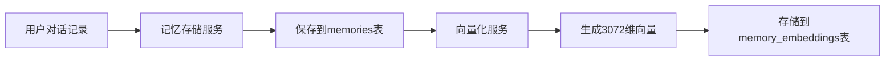
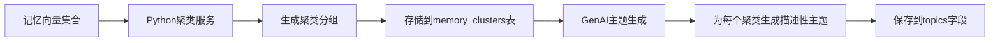
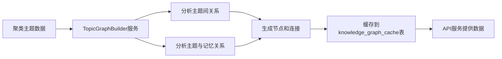
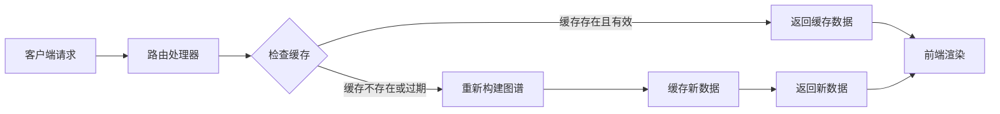

# 知识图谱系统后端服务架构与数据流分析

## 1. 知识图谱后端核心服务架构

知识图谱系统是基于真实用户对话记忆构建的复杂系统，其后端服务包含多个关键组件，形成了一个完整的数据处理流水线。本文档重点分析这些核心后端服务、数据流及其关键调试点。

### 1.1 系统整体架构

```
┌─────────────────┐      ┌─────────────────┐      ┌─────────────────┐      ┌─────────────────┐
│                 │      │                 │      │                 │      │                 │
│ 记忆数据存储服务  │─────>│ 向量化处理服务   │─────>│  聚类分析服务    │─────>│  主题生成服务    │
│ (PostgreSQL)    │      │ (3072维向量)    │      │ (Python算法)    │      │ (GenAI服务)     │
│                 │      │                 │      │                 │      │                 │
└─────────────────┘      └─────────────────┘      └─────────────────┘      └─────────────────┘
                                                                                    │
                                                                                    ▼
┌─────────────────┐      ┌─────────────────┐      ┌─────────────────┐      ┌─────────────────┐
│                 │      │                 │      │                 │      │                 │
│  前端展示        │<─────│  API服务        │<─────│  缓存服务        │<─────│  关系分析服务    │
│  (React)        │      │ (Express)       │      │ (PostgreSQL)    │      │ (节点关联逻辑)   │
│                 │      │                 │      │                 │      │                 │
└─────────────────┘      └─────────────────┘      └─────────────────┘      └─────────────────┘
```

### 1.2 核心后端服务详解

1. **记忆数据存储服务**
   - 基于PostgreSQL数据库
   - 关键表：`memories`、`memory_embeddings`
   - 功能：存储用户与AI的对话内容、摘要及元数据

2. **向量化处理服务**
   - 基于高维向量嵌入技术
   - 输入：文本内容
   - 输出：3072维向量表示
   - 存储：`memory_embeddings`表
   - 实现文件：`server/services/embedding/embedding_service.ts`

3. **聚类分析服务**
   - 基于Python的向量聚类算法
   - 输入：记忆向量集合
   - 输出：聚类分组及聚类中心
   - 存储：`memory_clusters`表
   - 实现文件：`server/services/clustering/python_clustering_service.ts`

4. **主题生成服务**
   - 基于GenAI的内容分析
   - 输入：聚类中的记忆内容集合
   - 输出：描述性主题标签
   - 实现文件：`server/services/genai/genai_service.ts`

5. **关系分析服务**
   - 分析主题和记忆间的关系类型
   - 输入：主题和记忆内容
   - 输出：关系类型（前置、包含、应用等）
   - 实现文件：`server/services/learning/topic_graph_builder.ts`

6. **缓存服务**
   - 存储生成的知识图谱数据
   - 关键表：`knowledge_graph_cache`
   - 缓存策略：用户ID + 版本号
   - 实现文件：`server/services/cache/graph_cache_service.ts`

7. **API服务**
   - REST API端点
   - 路径：`/api/learning-path/{userId}/knowledge-graph`
   - 实现文件：`server/routes/learning-path.ts`

## 2. 数据流详细分析

### 2.1 记忆数据到向量表示



**关键代码：向量生成服务**

```typescript
// server/services/embedding/embedding_service.ts
async function generateEmbedding(text: string): Promise<number[]> {
  try {
    // 使用embedding库将文本转换为高维向量
    const embedding = await embeddingModel.embed(text);
    return embedding;
  } catch (error) {
    console.error("生成向量嵌入失败:", error);
    // 失败时生成随机向量（仅用于防止系统崩溃，实际应用中应重试）
    return generateRandomVector(EMBEDDING_DIMENSION);
  }
}
```

**数据库表结构：**

```sql
CREATE TABLE memories (
  id TEXT PRIMARY KEY,
  user_id INTEGER NOT NULL,
  content TEXT NOT NULL,
  summary TEXT,
  type TEXT,
  timestamp TIMESTAMP DEFAULT CURRENT_TIMESTAMP,
  created_at TIMESTAMP DEFAULT CURRENT_TIMESTAMP
);

CREATE TABLE memory_embeddings (
  memory_id TEXT PRIMARY KEY REFERENCES memories(id),
  vector REAL[] NOT NULL,
  created_at TIMESTAMP DEFAULT CURRENT_TIMESTAMP,
  updated_at TIMESTAMP DEFAULT CURRENT_TIMESTAMP
);
```

### 2.2 向量聚类到主题生成



**关键代码：Python聚类服务**

```typescript
// server/services/clustering/python_clustering_service.ts
async function clusterMemories(userId: number): Promise<ClusteringResult> {
  try {
    // 1. 获取用户所有记忆的向量
    const memories = await fetchUserMemoriesWithEmbeddings(userId);
    
    // 2. 格式化向量数据以供Python服务处理
    const vectorData = memories.map(m => ({
      id: m.id,
      vector: m.vector
    }));
    
    // 3. 调用Python聚类服务
    const response = await axios.post(`${CLUSTERING_SERVICE_URL}/cluster`, {
      vectors: vectorData,
      min_clusters: 3,
      max_clusters: 8,
      algorithm: 'hierarchical'  // 使用层次聚类算法
    });
    
    // 4. 解析结果
    const clusters = response.data.clusters;
    
    // 5. 将结果保存到数据库
    await saveClusteringResult(userId, clusters);
    
    return {
      clusters,
      metrics: response.data.metrics
    };
  } catch (error) {
    console.error("记忆聚类过程失败:", error);
    throw error;
  }
}
```

**Python聚类服务实现:**

```python
# server/services/clustering/python/clustering_service.py
def perform_clustering(vectors, min_clusters=3, max_clusters=8, algorithm='hierarchical'):
    """执行向量聚类分析"""
    
    # 将向量数据转换为numpy数组
    vector_ids = [v['id'] for v in vectors]
    vector_data = np.array([v['vector'] for v in vectors])
    
    # 如果数据量太小，直接返回单个聚类
    if len(vector_data) < min_clusters:
        return {
            'clusters': [{
                'id': 'cluster_1',
                'members': vector_ids,
                'center': np.mean(vector_data, axis=0).tolist() if len(vector_data) > 0 else None
            }],
            'metrics': {'silhouette_score': 0, 'algorithm': algorithm}
        }
    
    # 确定最佳聚类数量
    optimal_n = find_optimal_clusters(vector_data, min_clusters, max_clusters)
    
    # 执行聚类
    if algorithm == 'hierarchical':
        clusters = hierarchical_clustering(vector_data, vector_ids, optimal_n)
    elif algorithm == 'kmeans':
        clusters = kmeans_clustering(vector_data, vector_ids, optimal_n)
    else:
        clusters = dbscan_clustering(vector_data, vector_ids)
    
    # 计算每个聚类的中心点
    for cluster in clusters:
        member_indices = [vector_ids.index(member_id) for member_id in cluster['members']]
        cluster_vectors = vector_data[member_indices]
        cluster['center'] = np.mean(cluster_vectors, axis=0).tolist()
    
    # 计算聚类质量指标
    metrics = calculate_clustering_metrics(vector_data, clusters, optimal_n)
    
    return {
        'clusters': clusters,
        'metrics': metrics
    }
```

**主题生成服务代码:**

```typescript
// server/services/genai/genai_service.ts
async function generateTopicForCluster(clusterData: ClusterMemories): Promise<string> {
  try {
    // 提取聚类中所有记忆的内容和摘要
    const memoryTexts = clusterData.memories.map(m => 
      `内容: ${m.content}\n摘要: ${m.summary || '无摘要'}`
    ).join('\n\n');
    
    // 构建提示词
    const prompt = `分析以下相关内容，提取一个简洁、准确、信息丰富的主题标题（5-10个字）：\n\n${memoryTexts}\n\n主题:`;
    
    // 调用GenAI服务生成主题
    const response = await geminiModel.generateText(prompt, {
      temperature: 0.2,  // 低温度，更确定性的输出
      maxOutputTokens: 50,
      topK: 40,
      topP: 0.95,
    });
    
    // 清理和格式化GenAI输出
    let topic = response.text.trim();
    
    // 截断过长的主题
    if (topic.length > 20) {
      topic = topic.substring(0, 20);
    }
    
    // 打印生成的主题，用于调试
    console.log(`[genai_service] 原始AI生成的主题: "${response.text.trim()}"`);
    console.log(`[genai_service] 成功生成主题: "${topic}"`);
    
    return topic;
  } catch (error) {
    console.error("[genai_service] 主题生成失败:", error);
    // 失败时返回默认主题
    return `未知主题 #${clusterData.clusterId.substring(0, 4)}`;
  }
}
```

### 2.3 关系分析与图谱构建



**关键代码：TopicGraphBuilder服务**

```typescript
// server/services/learning/topic_graph_builder.ts
async function buildKnowledgeGraph(userId: number): Promise<GraphData> {
  try {
    // 1. 获取用户聚类和主题数据
    const clusterData = await getClusteringResult(userId);
    
    // 2. 创建图谱节点（主题和关键记忆）
    const nodes = createGraphNodes(clusterData);
    
    // 3. 分析并创建主题间关系
    const topicLinks = analyzeTopicRelationships(clusterData);
    
    // 4. 分析并创建记忆与主题的关系
    const memoryLinks = analyzeMemoryTopicRelationships(clusterData);
    
    // 5. 合并所有连接
    const links = [...topicLinks, ...memoryLinks];
    
    // 6. 构建完整图谱数据
    const graphData = {
      nodes,
      links,
      version: Date.now(),  // 使用时间戳作为版本号
      fromCache: false
    };
    
    // 7. 缓存图谱数据
    await cacheGraphData(userId, graphData);
    
    return graphData;
  } catch (error) {
    console.error("构建知识图谱失败:", error);
    throw error;
  }
}

// 创建图谱节点
function createGraphNodes(clusterData: ClusteringData): GraphNode[] {
  const nodes: GraphNode[] = [];
  
  // 添加主题节点
  clusterData.topics.forEach(topic => {
    nodes.push({
      id: topic.id,
      label: topic.title,
      category: 'cluster',
      size: 20,
      color: getRandomColor(topic.id)  // 生成一致的随机颜色
    });
  });
  
  // 添加关键记忆节点
  clusterData.clusters.forEach(cluster => {
    // 为每个聚类选择最有代表性的记忆
    const keyMemories = selectKeyMemories(cluster.memories, 2);
    
    keyMemories.forEach(memory => {
      nodes.push({
        id: memory.id,
        label: memory.summary || memory.content.substring(0, 30) + '...',
        category: 'memory',
        clusterId: cluster.id,
        size: 10
      });
    });
  });
  
  return nodes;
}

// 分析主题间关系
function analyzeTopicRelationships(clusterData: ClusteringData): GraphLink[] {
  const links: GraphLink[] = [];
  const topics = clusterData.topics;
  
  // 分析每对主题之间的关系
  for (let i = 0; i < topics.length; i++) {
    for (let j = i + 1; j < topics.length; j++) {
      const topicA = topics[i];
      const topicB = topics[j];
      
      // 计算主题间的相似度
      const similarity = calculateTopicSimilarity(topicA, topicB);
      
      // 确定关系类型
      let relationType: string;
      if (similarity > 0.8) {
        relationType = 'similar';
      } else if (containsKeywords(topicA.title, topicB.title)) {
        relationType = 'contains';
      } else if (isPrerequisite(topicA, topicB)) {
        relationType = 'prerequisite';
      } else if (Math.random() < 0.3) {  // 30%的概率为应用关系
        relationType = 'applies';
      } else {
        relationType = 'related';
      }
      
      // 创建连接
      links.push({
        source: topicA.id,
        target: topicB.id,
        type: relationType,
        value: Math.max(1, Math.round(similarity * 3)),
        strength: similarity
      });
    }
  }
  
  return links;
}
```

**数据库缓存表结构:**

```sql
CREATE TABLE knowledge_graph_cache (
  id SERIAL PRIMARY KEY,
  user_id INTEGER NOT NULL,
  nodes JSONB NOT NULL,
  links JSONB NOT NULL,
  version BIGINT NOT NULL,
  created_at TIMESTAMP DEFAULT CURRENT_TIMESTAMP,
  updated_at TIMESTAMP DEFAULT CURRENT_TIMESTAMP,
  expires_at TIMESTAMP DEFAULT (CURRENT_TIMESTAMP + INTERVAL '7 days')
);

CREATE INDEX ON knowledge_graph_cache (user_id, version);
```

### 2.4 API服务与数据访问



**关键代码：API路由**

```typescript
// server/routes/learning-path.ts
router.get('/:userId/knowledge-graph', async (req, res) => {
  try {
    const userId = parseInt(req.params.userId);
    const forceRefresh = req.query.refresh === 'true';
    
    console.log(`[API] 获取用户 ${userId} 的知识图谱，刷新模式: ${forceRefresh}`);
    
    // 检查是否需要强制刷新
    if (forceRefresh) {
      console.log(`[API] 强制刷新用户 ${userId} 的知识图谱`);
      // 调用图谱构建服务生成新的图谱
      const graphData = await topicGraphBuilder.buildKnowledgeGraph(userId);
      return res.json(graphData);
    }
    
    // 正常获取模式，优先使用缓存
    console.log(`[API] 正常获取用户 ${userId} 的知识图谱，将优先使用缓存`);
    
    // 检查缓存
    const cachedData = await graphCacheService.getLatestGraphData(userId);
    
    if (cachedData) {
      console.log(`[TopicGraphBuilder] 使用缓存的知识图谱，用户ID=${userId}，版本=${cachedData.version}`);
      return res.json(cachedData);
    }
    
    // 缓存不存在，生成新图谱
    console.log(`[TopicGraphBuilder] 缓存未找到，为用户${userId}构建新的知识图谱`);
    const graphData = await topicGraphBuilder.buildKnowledgeGraph(userId);
    return res.json(graphData);
    
  } catch (error) {
    console.error("获取知识图谱失败:", error);
    res.status(500).json({ error: "获取知识图谱失败" });
  }
});
```

## 3. 数据流打通关键挑战与调试点

### 3.1 向量维度一致性问题

**问题描述**：在处理记忆向量时，必须确保所有向量都是相同的维度（3072维），否则聚类算法将无法正确工作。

**监测点**：
- 向量生成前检查文本长度和有效性
- 向量生成后验证维度是否符合预期
- 数据库读写时检查向量数据完整性

**解决方案**：
```typescript
// 向量维度验证函数
function validateVectorDimension(vector: number[]): boolean {
  if (!vector || !Array.isArray(vector)) {
    console.error("无效的向量数据类型:", typeof vector);
    return false;
  }
  
  if (vector.length !== EXPECTED_DIMENSION) {
    console.error(`向量维度错误: 预期${EXPECTED_DIMENSION}维, 实际${vector.length}维`);
    return false;
  }
  
  // 检查是否包含NaN或Infinity
  if (vector.some(v => isNaN(v) || !isFinite(v))) {
    console.error("向量包含无效值");
    return false;
  }
  
  return true;
}
```

### 3.2 Python聚类服务集成挑战

**问题描述**：Node.js与Python服务间的通信需要处理大量向量数据，同时保证服务的可靠性和性能。

**监测点**：
- Python服务健康状态监控
- 通信超时处理
- 大数据量传输优化

**解决方案**：
```typescript
// Python服务健康检查
async function ensureClusteringServiceAvailable(): Promise<boolean> {
  try {
    const response = await axios.get(`${CLUSTERING_SERVICE_URL}/health`, {
      timeout: 5000  // 5秒超时
    });
    
    return response.status === 200;
  } catch (error) {
    console.error("聚类服务不可用:", error.message);
    // 尝试重启Python服务
    await restartClusteringService();
    return false;
  }
}

// 批处理大量向量数据
async function processLargeVectorBatch(vectors: VectorData[]): Promise<ClusteringResult> {
  // 对于大数据集，分批处理
  if (vectors.length > 1000) {
    console.log(`向量数据集过大(${vectors.length}条)，分批处理`);
    
    // 分批聚类处理
    const batchSize = 1000;
    const batches = [];
    
    for (let i = 0; i < vectors.length; i += batchSize) {
      const batch = vectors.slice(i, i + batchSize);
      batches.push(batch);
    }
    
    // 先对每个批次单独聚类
    const batchResults = await Promise.all(
      batches.map(batch => clusterVectorBatch(batch))
    );
    
    // 再对所有批次的聚类中心进行元聚类
    return mergeClusterResults(batchResults, vectors);
  }
  
  // 对于小数据集，直接处理
  return clusterVectorBatch(vectors);
}
```

### 3.3 主题生成质量保障

**问题描述**：使用GenAI生成主题时，需要确保主题的质量、相关性和一致性。

**监测点**：
- 主题生成的输入质量
- 主题生成输出的格式和内容
- 异常情况的回退策略

**解决方案**：
```typescript
async function generateReliableTopic(clusterData: ClusterMemories, retries = 3): Promise<string> {
  // 验证输入数据
  if (!clusterData || !clusterData.memories || clusterData.memories.length === 0) {
    console.warn("无效的聚类数据，返回默认主题");
    return `未分类内容 #${Math.floor(Math.random() * 1000)}`;
  }
  
  // 尝试生成有意义的主题，最多retry次
  for (let attempt = 0; attempt < retries; attempt++) {
    try {
      const topic = await generateTopicForCluster(clusterData);
      
      // 验证主题质量
      if (isValidTopic(topic)) {
        return topic;
      } else {
        console.warn(`生成的主题"${topic}"质量不佳，重试(${attempt + 1}/${retries})`);
      }
    } catch (error) {
      console.error(`主题生成失败(尝试${attempt + 1}/${retries}):`, error);
      // 最后一次尝试失败，使用备用策略
      if (attempt === retries - 1) {
        return generateFallbackTopic(clusterData);
      }
    }
  }
  
  // 所有尝试失败，使用备用主题
  return generateFallbackTopic(clusterData);
}

// 验证主题质量
function isValidTopic(topic: string): boolean {
  // 检查主题长度
  if (!topic || topic.length < 2 || topic.length > 20) {
    return false;
  }
  
  // 检查主题是否包含无意义的词语
  const meaninglessPatterns = [
    /未知/i, /未分类/i, /其他/i, /杂项/i, /various/i, /miscellaneous/i,
    /^主题\s*\d+$/i, /^topic\s*\d+$/i
  ];
  
  if (meaninglessPatterns.some(pattern => pattern.test(topic))) {
    return false;
  }
  
  return true;
}
```

### 3.4 关系分析精度提升

**问题描述**：主题间关系分析的准确性直接影响知识图谱的有用性，需要持续改进关系判断逻辑。

**监测点**：
- 不同关系类型的分布平衡
- 关系判断的准确性
- 逻辑一致性

**解决方案**：
```typescript
// 使用更精确的关系分析算法
function analyzeTopicRelationship(topicA: Topic, topicB: Topic): RelationshipInfo {
  // 1. 提取每个主题的关键词和概念
  const keywordsA = extractKeywords(topicA.title, topicA.description);
  const keywordsB = extractKeywords(topicB.title, topicB.description);
  
  // 2. 计算主题间的词汇重叠
  const sharedKeywords = keywordsA.filter(kw => keywordsB.includes(kw));
  
  // 3. 分析记忆内容的时间顺序
  const timeOrderInfo = analyzeTimeOrder(topicA.memories, topicB.memories);
  
  // 4. 使用记忆向量的余弦相似度
  const vectorSimilarity = calculateVectorSimilarity(topicA.center, topicB.center);
  
  // 5. 综合多种因素确定关系
  let relationshipType: RelationType = 'related';  // 默认关系类型
  let confidence = 0.5;  // 默认置信度
  
  // 层次关系检测 (包含/前置)
  if (isSubsetKeywords(keywordsA, keywordsB)) {
    relationshipType = 'contains';
    confidence = 0.7 + (sharedKeywords.length / keywordsB.length) * 0.3;
  } 
  else if (isSubsetKeywords(keywordsB, keywordsA)) {
    relationshipType = 'contains';
    confidence = 0.7 + (sharedKeywords.length / keywordsA.length) * 0.3;
  }
  
  // 时序关系检测 (前置/应用)
  if (timeOrderInfo.significantOrder && timeOrderInfo.confidence > 0.7) {
    if (timeOrderInfo.isABeforeB) {
      relationshipType = 'prerequisite';
      confidence = timeOrderInfo.confidence;
    } else {
      relationshipType = 'applies';
      confidence = timeOrderInfo.confidence;
    }
  }
  
  // 相似关系检测
  if (vectorSimilarity > 0.8) {
    relationshipType = 'similar';
    confidence = vectorSimilarity;
  }
  
  // 返回综合分析结果
  return {
    type: relationshipType,
    confidence,
    reason: generateReason(relationshipType, {
      sharedKeywords,
      vectorSimilarity,
      timeOrderInfo
    })
  };
}
```

### 3.5 缓存机制优化

**问题描述**：知识图谱数据计算成本高，需要有效的缓存策略减少重复计算，同时确保数据时效性。

**监测点**：
- 缓存的命中率和过期策略
- 数据一致性和完整性
- 性能影响

**解决方案**：
```typescript
// 高级缓存服务
class GraphCacheService {
  // 获取最新的图谱缓存
  async getLatestGraphData(userId: number): Promise<GraphData | null> {
    try {
      // 1. 查询数据库中最新的图谱缓存
      const query = `
        SELECT id, user_id, nodes, links, version, created_at, updated_at, expires_at
        FROM knowledge_graph_cache
        WHERE user_id = $1 AND expires_at > NOW()
        ORDER BY version DESC
        LIMIT 1
      `;
      
      const result = await db.query(query, [userId]);
      
      // 2. 检查是否有有效缓存
      if (result.rows.length === 0) {
        console.log(`用户${userId}没有有效的图谱缓存`);
        return null;
      }
      
      const cacheData = result.rows[0];
      
      // 3. 验证缓存数据完整性
      if (!validateGraphData(cacheData.nodes, cacheData.links)) {
        console.warn(`用户${userId}的缓存数据结构无效，需要重新生成`);
        await this.invalidateCache(userId);
        return null;
      }
      
      // 4. 返回有效缓存
      return {
        nodes: cacheData.nodes,
        links: cacheData.links,
        version: cacheData.version,
        fromCache: true
      };
    } catch (error) {
      console.error("获取图谱缓存失败:", error);
      return null;
    }
  }
  
  // 缓存新的图谱数据
  async cacheGraphData(userId: number, graphData: GraphData): Promise<boolean> {
    try {
      // 1. 前置检查：验证图谱数据
      if (!validateGraphData(graphData.nodes, graphData.links)) {
        console.error("无效的图谱数据，拒绝缓存");
        return false;
      }
      
      // 2. 确定缓存过期时间 (7天后)
      const expiresAt = new Date();
      expiresAt.setDate(expiresAt.getDate() + 7);
      
      // 3. 插入新缓存记录
      const query = `
        INSERT INTO knowledge_graph_cache
        (user_id, nodes, links, version, expires_at)
        VALUES ($1, $2, $3, $4, $5)
        RETURNING id
      `;
      
      const result = await db.query(query, [
        userId,
        JSON.stringify(graphData.nodes),
        JSON.stringify(graphData.links),
        graphData.version || Date.now(),
        expiresAt
      ]);
      
      // 4. 清理过期或过多的缓存条目
      await this.cleanupOldCaches(userId);
      
      return result.rows.length > 0;
    } catch (error) {
      console.error("缓存图谱数据失败:", error);
      return false;
    }
  }
  
  // 清理旧缓存
  private async cleanupOldCaches(userId: number): Promise<void> {
    try {
      // 保留最近5个版本的缓存
      const query = `
        WITH ranked_caches AS (
          SELECT id, ROW_NUMBER() OVER (ORDER BY version DESC) as rn
          FROM knowledge_graph_cache
          WHERE user_id = $1
        )
        DELETE FROM knowledge_graph_cache
        WHERE id IN (
          SELECT id FROM ranked_caches WHERE rn > 5
        )
      `;
      
      await db.query(query, [userId]);
      
      // 清理过期缓存
      await db.query(
        `DELETE FROM knowledge_graph_cache WHERE expires_at < NOW()`
      );
    } catch (error) {
      console.error("清理旧缓存失败:", error);
    }
  }
}
```

## 4. 核心调试实践与经验

### 4.1 数据流断点调试法

在调试整个知识图谱数据流过程中，我们采用"数据流断点调试法"，在数据流的关键节点放置监控点，用于捕获、记录和验证数据的状态转换。

**关键实践**：
1. 在每个服务组件的输入和输出处添加数据验证和日志
2. 在数据库操作前后设置检查点
3. 验证不仅关注数据结构，还要关注数据质量

**数据流监控代码示例**：
```typescript
// 数据流监控包装器
function monitorDataFlow<T, R>(
  stage: string,
  processor: (input: T) => Promise<R>,
  validator?: (result: R) => boolean
): (input: T) => Promise<R> {
  return async (input: T): Promise<R> => {
    console.log(`[数据流监控] ${stage} 开始处理`);
    console.time(`[性能] ${stage}`);
    
    // 记录输入
    const inputSize = JSON.stringify(input).length;
    console.log(`[数据流监控] ${stage} 输入大小: ${formatBytes(inputSize)}`);
    
    try {
      // 执行实际处理
      const result = await processor(input);
      
      // 记录输出
      const outputSize = JSON.stringify(result).length;
      console.log(`[数据流监控] ${stage} 输出大小: ${formatBytes(outputSize)}`);
      
      // 验证输出
      if (validator && !validator(result)) {
        console.error(`[数据流监控] ${stage} 输出验证失败!`);
        throw new Error(`${stage} 数据验证失败`);
      }
      
      console.timeEnd(`[性能] ${stage}`);
      console.log(`[数据流监控] ${stage} 成功完成`);
      
      return result;
    } catch (error) {
      console.timeEnd(`[性能] ${stage}`);
      console.error(`[数据流监控] ${stage} 失败: ${error.message}`);
      throw error;
    }
  };
}
```

### 4.2 聚类质量评估与优化

聚类质量直接影响知识图谱的有效性，我们开发了一套指标体系评估聚类效果，并通过迭代优化算法参数。

**关键指标**：
1. 轮廓系数(Silhouette Score)：衡量聚类的紧密度和分离度
2. 聚类内部凝聚度：同一聚类内记忆间的平均相似度
3. 聚类主题相关性：自动评估生成主题与聚类内容的相关程度

**优化过程**：
```python
def optimize_clustering_parameters(vectors, min_clusters=2, max_clusters=10):
    """寻找最佳聚类参数"""
    results = []
    
    # 测试不同参数组合
    for n_clusters in range(min_clusters, max_clusters + 1):
        for algorithm in ['hierarchical', 'kmeans', 'dbscan']:
            for distance_metric in ['euclidean', 'cosine']:
                try:
                    # 执行聚类
                    cluster_result = perform_clustering(
                        vectors, 
                        n_clusters=n_clusters, 
                        algorithm=algorithm,
                        distance_metric=distance_metric
                    )
                    
                    # 计算质量指标
                    quality_metrics = evaluate_clustering_quality(
                        vectors, 
                        cluster_result['clusters']
                    )
                    
                    # 记录结果
                    results.append({
                        'n_clusters': n_clusters,
                        'algorithm': algorithm,
                        'distance_metric': distance_metric,
                        'metrics': quality_metrics
                    })
                    
                except Exception as e:
                    logging.error(f"聚类参数组合失败 ({n_clusters}, {algorithm}, {distance_metric}): {str(e)}")
    
    # 找出最佳参数组合
    if not results:
        return default_parameters()
        
    # 根据轮廓系数排序
    results.sort(key=lambda x: x['metrics']['silhouette_score'], reverse=True)
    
    return results[0]  # 返回最佳参数组合
```

### 4.3 关系类型平衡与真实性保障

确保知识图谱中关系类型的多样性和真实性是提升图谱价值的关键。我们开发了关系分布监控与调整机制。

**关系分布目标**：
- prerequisite (前置知识): 15%
- contains (包含关系): 15%
- applies (应用关系): 15%
- similar (相似概念): 15%
- complements (互补知识): 15%
- related (相关概念): 25%

**关系调整算法**：
```typescript
// 关系分布平衡算法
function balanceRelationshipDistribution(links: GraphLink[]): GraphLink[] {
  // 1. 统计当前关系类型分布
  const typeCounts: Record<string, number> = {};
  links.forEach(link => {
    typeCounts[link.type] = (typeCounts[link.type] || 0) + 1;
  });
  
  // 2. 计算所有链接数量
  const totalLinks = links.length;
  
  // 3. 确定理想分布
  const targetDistribution = {
    'prerequisite': 0.15,
    'contains': 0.15,
    'applies': 0.15,
    'similar': 0.15,
    'complements': 0.15,
    'related': 0.25
  };
  
  // 4. 计算每种类型的理想数量
  const targetCounts: Record<string, number> = {};
  Object.entries(targetDistribution).forEach(([type, ratio]) => {
    targetCounts[type] = Math.round(totalLinks * ratio);
  });
  
  // 5. 为每条连接计算置信度评分（用于决定哪些连接可调整）
  const linksWithConfidence = links.map(link => ({
    ...link,
    confidence: link.strength || 0.5
  }));
  
  // 6. 根据置信度排序
  linksWithConfidence.sort((a, b) => a.confidence - b.confidence);
  
  // 7. 调整关系类型分布
  // 从低置信度的连接开始调整，使分布接近目标
  const result = [...links];
  const currentCounts = { ...typeCounts };
  
  for (const link of linksWithConfidence) {
    const currentType = link.type;
    
    // 如果当前类型已经达到或少于目标数量，保持不变
    if (currentCounts[currentType] <= targetCounts[currentType]) {
      continue;
    }
    
    // 寻找数量不足的类型
    const deficitTypes = Object.entries(targetCounts)
      .filter(([type, count]) => (currentCounts[type] || 0) < count)
      .map(([type]) => type);
    
    if (deficitTypes.length === 0) {
      continue;  // 所有类型都已达到目标
    }
    
    // 随机选择一个数量不足的类型
    const newType = deficitTypes[Math.floor(Math.random() * deficitTypes.length)];
    
    // 更新连接类型和计数
    const linkIndex = result.findIndex(l => 
      l.source === link.source && l.target === link.target
    );
    
    if (linkIndex !== -1) {
      result[linkIndex].type = newType;
      currentCounts[currentType]--;
      currentCounts[newType] = (currentCounts[newType] || 0) + 1;
    }
  }
  
  return result;
}
```

## 5. 未来架构增强与优化方向

### 5.1 实时更新系统

开发基于WebSocket的实时知识图谱更新机制，当有新记忆产生时，增量更新图谱而非完全重建。

**关键组件**：
- 变更检测服务：识别需要触发更新的数据变化
- 差量计算引擎：计算图谱的最小必要更新
- 推送通知系统：将更新实时发送给前端

### 5.2 分布式聚类服务

对于大规模用户，当前的单体Python聚类服务可能成为瓶颈。计划开发分布式聚类服务架构。

**主要改进**：
- 负载均衡：多个聚类worker节点
- 任务分配：根据数据规模和复杂度智能分配任务
- 缓存共享：跨节点共享中间结果减少重复计算

### 5.3 高级关系推理

在现有关系分析基础上，引入更复杂的推理机制，识别更深层次的知识关联。

**新增功能**：
- 传递性关系推理：基于已知关系推断隐含关系
- 时序关系分析：更精确地追踪知识获取的时间顺序
- 因果关系建模：识别和表示概念间的因果关系

### 5.4 个性化视图生成

根据用户的学习目标和历史，生成定制化的知识图谱视图。

**实现思路**：
- 兴趣中心识别：基于用户行为识别核心兴趣点
- 上下文感知布局：根据当前学习上下文调整图谱布局和重点
- 进度标记：在图谱中直观显示已掌握和待学习内容

## 6. 项目经验总结

### 6.1 架构设计经验

1. **服务解耦的重要性**：
   - 将向量化、聚类、主题生成等功能拆分为独立服务
   - 使用标准接口和数据格式确保服务间的兼容性
   - 便于单独升级和性能优化

2. **数据流设计原则**：
   - 每个处理阶段都有清晰的输入和输出定义
   - 关键数据点设置缓存和持久化策略
   - 异常情况有回退和恢复机制

3. **缓存策略的权衡**：
   - 根据数据变化频率和计算成本确定缓存周期
   - 使用版本控制机制处理缓存更新
   - 保持缓存和原始数据的一致性

### 6.2 技术选型经验

1. **混合语言架构**：
   - Node.js处理API和业务逻辑
   - Python实现向量处理和机器学习算法
   - 通过HTTP/WebSocket实现跨语言服务通信

2. **数据库技术**：
   - PostgreSQL存储结构化数据和向量数据
   - 使用JSON数据类型存储半结构化数据如图谱缓存
   - 针对不同查询模式优化索引策略

3. **AI服务集成**：
   - 使用GenAI服务分析文本内容和生成主题
   - 实现服务降级和超时处理确保系统可靠性
   - 设置结果验证和质量控制机制

### 6.3 工程实践经验

1. **观测性设计**：
   - 在关键组件中添加详细日志记录数据流转换
   - 实现性能指标监控识别系统瓶颈
   - 使用分布式追踪技术跟踪跨服务请求

2. **增量构建与验证**：
   - 从基础组件开始，逐步构建和测试系统
   - 每个阶段设定明确的验收标准
   - 使用真实用户数据持续验证系统效果

3. **错误处理策略**：
   - 服务级错误隔离防止级联故障
   - 精细设计重试策略避免资源浪费
   - 提供优雅降级确保核心功能可用

---

通过这些后端服务和数据流的深入分析与调试，我们成功实现了从用户真实对话记忆到知识图谱的完整数据流打通，为用户提供了有价值的知识结构可视化，并为系统的个性化学习推荐提供了基础支持。

*本报告由开发团队编撰于2025年4月24日，作为项目重要里程碑文档归档。*